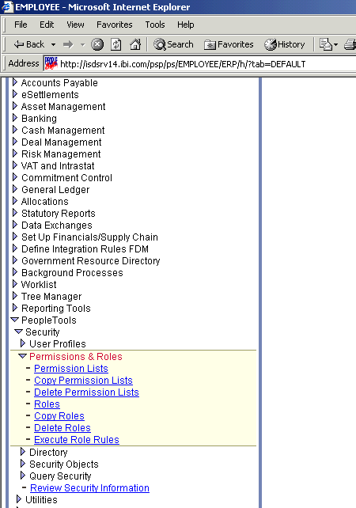
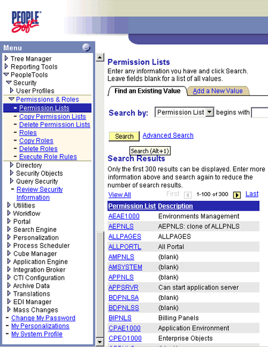
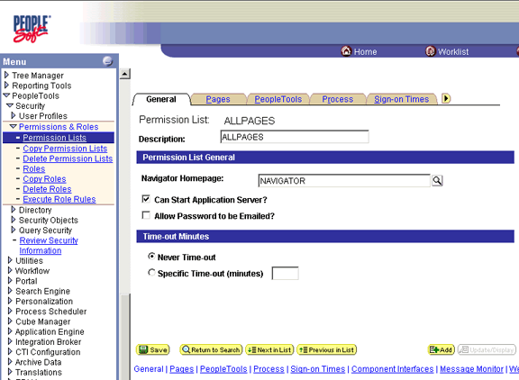
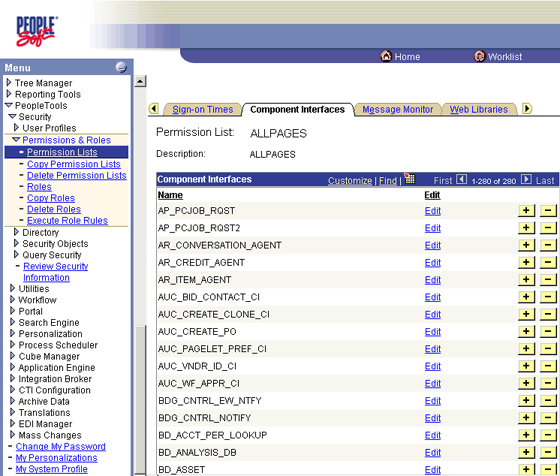
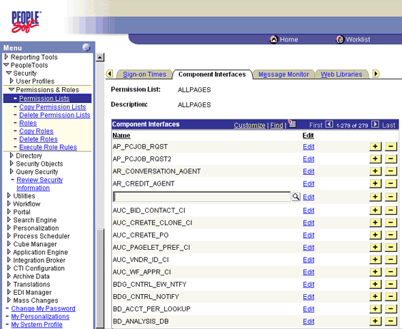
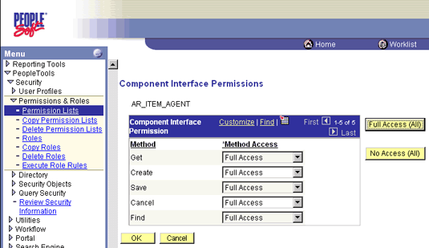
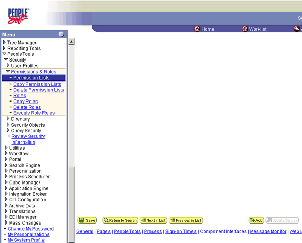

# How to Help Secure Component Interfaces
Before you can start testing a component interface, you must set up security for it. The following procedure describes how to configure component interface security for PeopleSoft Version 8.4, but you can use the procedure for Version 8.1.  
  
### To configure interface security  
  
1.  Expand **PeopleTools**, expand **Security**, expand **User Profiles**, and then expand **Permissions & Roles**.  
  
       
  
2.  Click **Permission Lists**.  
  
3.  Click **Search**.  
  
       
  
4.  In the **Permission Lists Search** pane, select the relevant permission list.  
  
     The following window appears.  
  
       
  
5.  Click the right arrow next to the **Sign-on Times** tab to display more tabs.  
  
       
  
6.  Click the **Component Interfaces** tab.  
  
7.  Click the + (plus) sign to add a new row to the **Component Interfaces** list.  
  
     A field appears in which you can type the component interface name.  
  
       
  
8.  Type the component interface name, and then click **Edit**.  
  
     This example uses component interface AR_ITEM_AGENT.  
  
       
  
9. In the list, select the desired access level for each method, and then click **OK**.  
  
     The following window appears.  
  
       
  
10. Scroll down in the right pane, and click **Save**.  
  
## See Also  
 [Appendix A: Component Interface Methods](../core/appendix-a-component-interface-methods.md)   
 [Appendix C: Using Component Interfaces](../core/appendix-c-using-component-interfaces.md)
