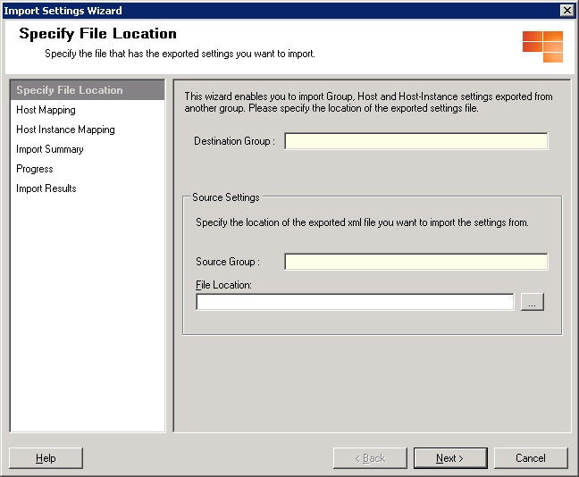
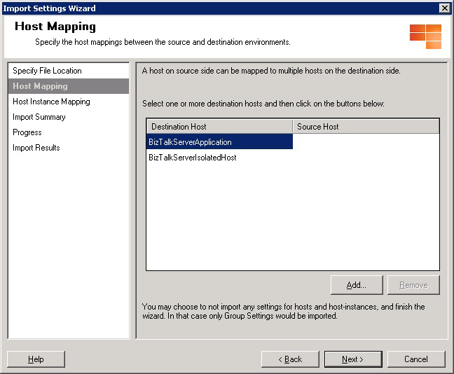
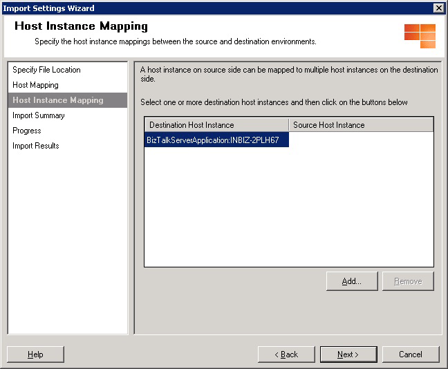
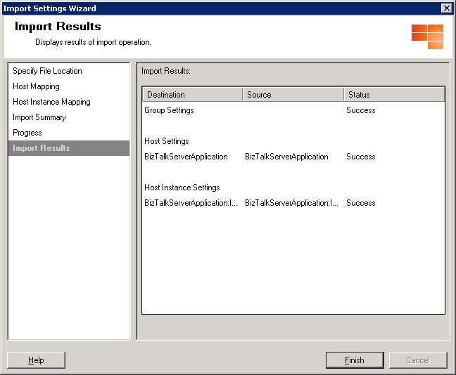

# Use Settings Dashboard to import or export BizTalk Settings 

## Overview
Using the BizTalk Settings Dashboard, you can export the settings from a [!INCLUDE[btsBizTalkServerNoVersion](../includes/btsbiztalkservernoversion-md.md)] environment and import them to another [!INCLUDE[btsBizTalkServerNoVersion](../includes/btsbiztalkservernoversion-md.md)] environment, thereby reducing the overall time-to-solution. This is especially useful in scenarios where the administrators try to tune [!INCLUDE[btsBizTalkServerNoVersion](../includes/btsbiztalkservernoversion-md.md)] performance in a staging environment, and upon achieving the desired results, they can import the settings into a production environment. This topic provides step-by-step procedure to import the BizTalk Group, Host, and Host Instance settings using Settings Dashboard.  

> [!TIP]
> The BTSTask command-line utility can also be used to import or export the Group, Host, and Host Instance settings. See [Import or export BizTalk Settings Using BTSTask](how-to-import-biztalk-settings-using-btstask.md).

  
## Prerequisites  
 To perform this operation, you must be signed in as a member of the BizTalk Server Administrators group.  
  
## Import the BizTalk group, host, and host instance settings  

> [!IMPORTANT]
>  To import the BizTalk Server settings from a certain environment, you should have already saved and exported those settings in an XML file. **Export BizTalk Settings** (in this topic) or [Import or export BizTalk Settings Using BTSTask](how-to-import-biztalk-settings-using-btstask.md) can help.
  
 By importing the XML file, you can replicate the required BizTalk Server settings on the target machine. Using the Settings dashboard, you can import the Group, Host, and Host Instance settings and map the properties of one to another. Following are the necessary assumptions for importing the settings:  
  
-   The BizTalk Server topology is consistent from the source environment to the destination environment.  
  
-   The host definitions across source and destination environments can be mapped. You should be able to map all hosts in the source environment with those in the destination environment.  
  
-   The destination environment has hardware similar (if not identical) to the source environment. This is essential as some of the settings depend on the underlying hardware.  

### Import steps
  
1. In the **BizTalk Server Administration Console**, expand [!INCLUDE[btsBizTalkServerAdminConsoleui](../includes/btsbiztalkserveradminconsoleui-md.md)], right-click **BizTalk Group**, and then click **Settings**.  
  
2. In the **BizTalk Settings Dashboard** dialog box, click **Import**. The **Import Settings Wizard** dialog box appears.  
  
   > [!NOTE]
   >  The **Destination Group** displays the group information of the target machine where you want to import the settings.  
  
      
  
3. Click the **Specify File Location** page, and then click . The file explorer appears.  
  
4. Select the XML file containing the source environment settings, and then click **Open**. The **File Location** displays the path of the XML file and the **Source Group** is populated with the group information of the source machine. Click **Next**.  
  
5. On the **Host Mapping** page, do the following:  
  
   1.  From the **Destination Hosts** list, select a destination host for which you want to specify the source host, and then click **Add**.  
  
          
  
   2.  In the **Select Source Entity** dialog box, select the source host, and then click **OK**.  
  
       > [!NOTE]
       >  To map multiple destination hosts to a single source host, repeat the steps **5a** and **5b**.  
  
   3.  In the **Host Mapping** page, click **Next**.  
  
6. In the **Host Instance Mapping** page, do the following:  
  
   1.  From the list of destination host instances, select a destination host instance for which you want to specify the source host instance, and then click **Add**.  
  
       > [!NOTE]
       >  Host instances can be mapped only to the corresponding host that has been created in the Host Mapping. For example, if you specify a mapping where **SourceHost1** is mapped to **DestinationHost1**, then the instances of **DestinationHost1** can only be mapped to the instances of **SourceHost1**.  
       >   
       >  The import wizard manages the above constraint, you need to follow this constraint else BizTalk tasks will throw errors.  
       >   
       >  You need to use the convention **HostName:MachineName** to specify a host instance in a map file. For example, **Host1:Server1** in a map file denotes that the instance of **Host1** is running or available on **Server1**.  
  
          
  
   2.  In the **Select Source Entity** dialog box, select the source host instance, and then click **OK**.  
  
       > [!NOTE]
       >  To map multiple destination host instances to a single source host instance, repeat the steps **6a** to **6b**.  
  
   3.  In the **Host Instance Mapping** tab, click **Next**.  
  
7. In the **Import Summary** dialog box, verify if all the import settings for destination and source environments you created are as desired, and then click **Import**. The **Progress** page shows the progress of import of the settings.  
  
   > [!WARNING]
   >  You cannot undo the import of BizTalk Server settings. If you click **Import**, the process for importing the settings from source environment to destination environment is initiated and **Cancel** is disabled. Ensure you want to proceed with import before clicking **Import**.  
  
8. In the **Import Results** tab, check the import status of the Group, Host, and Host Instance settings, and then click **Finish** to complete the import operation. All the imported source environment settings are applied to the destination environment.  
  
      

## Export the BizTalk group, host, and host instance settings  

1. In the **BizTalk Server Administration Console**, expand [!INCLUDE[btsBizTalkServerAdminConsoleui](../includes/btsbiztalkserveradminconsoleui-md.md)], right-click **BizTalk Group**, and then click **Settings**.  
  
2. In the **BizTalk Settings Dashboard** dialog box, click **Export**. The **Save As** dialog box appears.  
  
3. Browse to the location where you want to save the current BizTalk settings. Enter the filename, select the type as XML format, and then click **Save**.  

> [!IMPORTANT]
>  We do not not recommended manually updating the exported XML file. When you import an updated XML file to a production environment, the import process might fail due to some data type mismatch or other errors introduced by manual editing.  

## See Also  
 [Using Settings Dashboard for BizTalk Server Performance Tuning](../core/using-settings-dashboard-for-biztalk-server-performance-tuning.md)