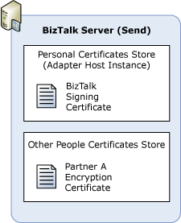

# How to Install the Certificates for Encrypted Messages
The following procedure lists the high-level steps that you have to follow to install the certificates for receiving and sending encrypted messages.  
  
-   To install certificates in the certificates store for decryption  
  
-   To install certificates in the certificates store for encryption  
  
-   To configure BizTalk hosts for receiving encrypted messages  
  
> [!NOTE]
>  You can use one certificate for both signing and decryption operations, or you can use one certificate for each function.  
  
### To install the decryption certificates in the certificates store  
  
1. An administrator in your organization requests a private-public key pair for encryption from the certification authority (CA) for [!INCLUDE[btsBizTalkServerNoVersion](../includes/btsbiztalkservernoversion-md.md)] to use.  
  
2. The administrator sends the public key for encryption to Partner A.  
  
3. In [!INCLUDE[btsBizTalkServerNoVersion](../includes/btsbiztalkservernoversion-md.md)], log on as the service account for the host instance running the handler that will receive messages from Partner A. Install the [!INCLUDE[btsBizTalkServerNoVersion](../includes/btsbiztalkservernoversion-md.md)] private key certificate for decrypting messages in the personal store for the service account. The following figure shows the certificate store where you install the certificate.  
  
      
  
4. In Partner A, install the [!INCLUDE[btsBizTalkServerNoVersion](../includes/btsbiztalkservernoversion-md.md)] public key certificate for encrypting messages sent to Partner A in the appropriate store. (If Partner A is using [!INCLUDE[btsWin2kSvr](../includes/btswin2ksvr-md.md)], [!INCLUDE[btsWinSvr2k3](../includes/btswinsvr2k3-md.md)], [!INCLUDE[btsWinSvr2k8](../includes/btswinsvr2k8-md.md)], install the public key in the Other People store.)  
  
### To install the encryption certificates in the certificates store  
  
1. Partner A requests a private-public key pair for encryption from the CA.  
  
2. Partner A installs the private key certificate for decrypting the messages in the appropriate store. (If Partner A is using [!INCLUDE[btsWin2kSvr](../includes/btswin2ksvr-md.md)], [!INCLUDE[btsWinSvr2k3](../includes/btswinsvr2k3-md.md)], [!INCLUDE[btsWinSvr2k8](../includes/btswinsvr2k8-md.md)], install the private key in the personal certificate store.)  
  
3. Partner A sends you its public key for encrypting messages sent to Partner A.  
  
4. In [!INCLUDE[btsBizTalkServerNoVersion](../includes/btsbiztalkservernoversion-md.md)], log on to the server that has a host instance running a handler that will send messages to Partner A. Install the Partner A public key certificate for encrypting messages sent to Partner A in the Other People store. The following figure shows the certificate store where you install the certificate.  
  
      
  
### To configure BizTalk hosts for receiving encrypted messages  
  
1. Click **Start**, point to **All Programs**, point to [!INCLUDE[btsBizTalkServerStartMenuItemui](../includes/btsbiztalkserverstartmenuitemui-md.md)], and then click **BizTalk Server Administration**.  
  
2. In the [!INCLUDE[btsBizTalkServerNoVersion](../includes/btsbiztalkservernoversion-md.md)] Administration console, expand **Platform Settings**, expand **Hosts**.  
  
   1.  On the right pane, right-click a BizTalk host that is the handler for receiving the encrypted messages, and then click **Properties**.  
  
   2.  On the **Host Properties** dialog box, click **Certificate**, click **Browse**.  
  
   3.  On the **Select Certificate** dialog box, select the decryption certificate that you installed, and then close all of the dialog boxes.  
  
       > [!NOTE]
       >  For more information, see [How to Modify Host Properties](../core/how-to-modify-host-properties.md).  
  
## Next Steps  
 You create a pipeline to receive encrypted messages in [How to Configure BizTalk Server for Receiving Encrypted Messages](../core/how-to-configure-biztalk-server-for-receiving-encrypted-messages.md)  
  
 You create a pipeline to send encrypted messages in [How to Configure BizTalk Server for Sending Encrypted Messages](../core/how-to-configure-biztalk-server-for-sending-encrypted-messages.md)  
  
## See Also  
 [Certificates that BizTalk Server Uses for Encrypted Messages](../core/certificates-that-biztalk-server-uses-for-encrypted-messages.md)   
 [Sending and Receiving Encrypted Messages](../core/sending-and-receiving-encrypted-messages.md)