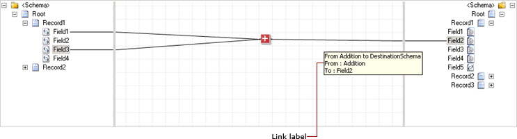
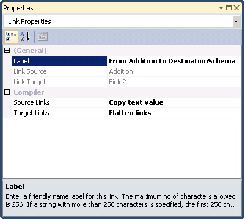

# How to Label a Link
Labels are helpful to document the purpose of a functoid or a link in a map. You can use the **Label** property to name a link. This is useful when your map contains big schema structures and identifying the inputs and output links to a functoid becomes difficult.  
  
> [!NOTE]
>  For information on how to label and comment functoids, see [How to Label and Comment a Functoid](../core/how-to-label-and-comment-a-functoid.md).  
  
 The following figure shows a link label.  
  
   
  
## Prerequisites  
 These instructions require that BizTalk Mapper is running.  
  
### To add a label to a link  
  
1.  Select the link you want to label.  
  
2.  In the **Properties** window, provide the new name in the **Label** field.  
  
    > [!IMPORTANT]
    >  The maximum number of characters allowed is 256. If a string with more than 256 characters is specified, the first 256 characters are accepted and the rest are discarded.  
  
       
  
## See Also  
 [Using Links to Specify Record and Field Mappings](../core/using-links-to-specify-record-and-field-mappings.md)
