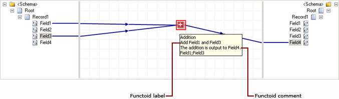

# How to Label and Comment a Functoid
Labels and comments are helpful to document the purpose of a functoid or a link in a map. You can use the **Label** property to provide a name for a functoid. The **Comments** property enables you to provide additional information about the functoid, typically relevant information about the operation being performed by it.  
  
 The following figure shows the label and comments for a functoid. The functoid adds two inputs (Field1 and Field3) from the source schema and outputs the result to Field4 in the target schema. In this example, the functoid label is “Add Field1 and Field3” and the comment is “The addition is an output to Field4”.  
  
   
  
 Because a functoid can be a part of very complex mapping, it is important to label it properly and also to provide relevant comments. You can label both functoids and links. For information on how to label a link, see [How to Label a Link](../core/how-to-label-a-link.md).  
  
 You can label and comment a functoid in the following ways:  
  
-   By using the **Configure \<Functoid> Functoid** dialog box.  
  
-   By using the **Properties** window.  
  
## Prerequisites  
 These instructions require that BizTalk Mapper is running.  
  
### To label and comment a functoid from Configure dialog box  
  
1.  Right-click the functoid you want to label and comment, and then click **Configure Functoid Inputs**.  
  
2.  In the **Configure \<Functoid> Functoid** dialog box, click the **Label and Comments** tab.  
  
3.  Enter the following information, and then click **OK**.  
  
    -   **Label –** Enter the new name.  
  
        > [!IMPORTANT]
        >  The maximum number of characters allowed is 256. If a string with more than 256 characters is specified, the first 256 characters are accepted and the rest are discarded.  
  
    -   **Comments –** Enter the comments for the functoid.  
  
        > [!IMPORTANT]
        >  The maximum number of characters allowed is 1024. If a string with more than 1024 characters is specified, the first 1024 characters are accepted and the rest are discarded.  
  
### To label and comment a functoid from Properties window  
  
1.  Select the functoid you want to label and comment.  
  
2.  In the **Properties** window, enter the following information, and then click **OK**.  
  
    -   **Label –** Enter the new name.  
  
        > [!IMPORTANT]
        >  The maximum number of characters allowed is 256. If a string with more than 256 characters is specified, the first 256 characters are accepted and the rest are discarded.  
  
    -   **Comments –** Enter the comments for the functoid.  
  
        > [!IMPORTANT]
        >  The maximum number of characters allowed is 1024. If a string with more than 1024 characters is specified, the first 1024 characters are accepted and the rest are discarded.  
  
## See Also  
 [Editing Functoid Properties and Input Parameters](../core/editing-functoid-properties-and-input-parameters.md)