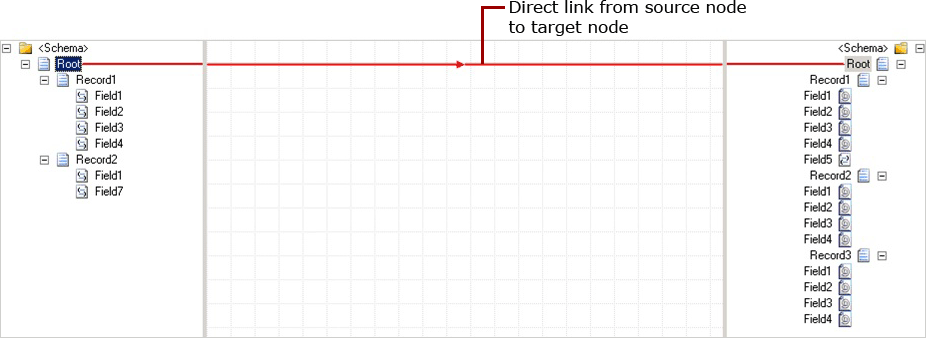
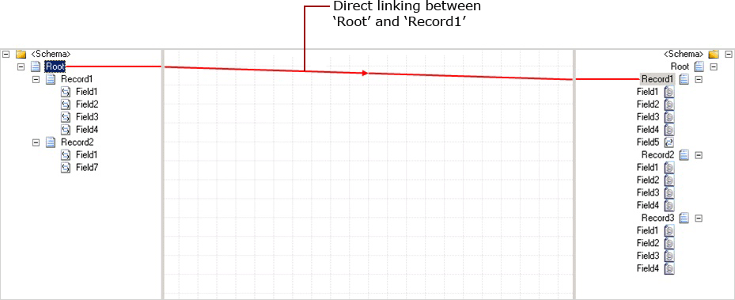
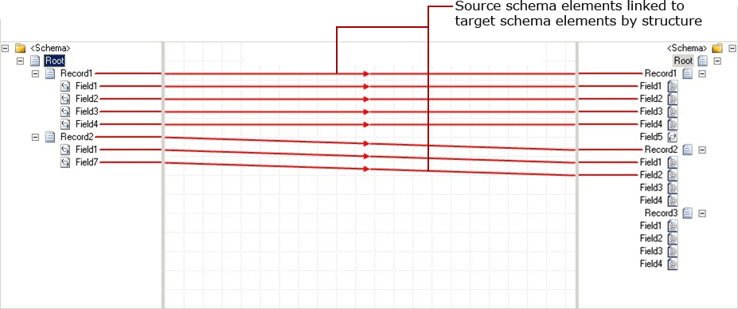
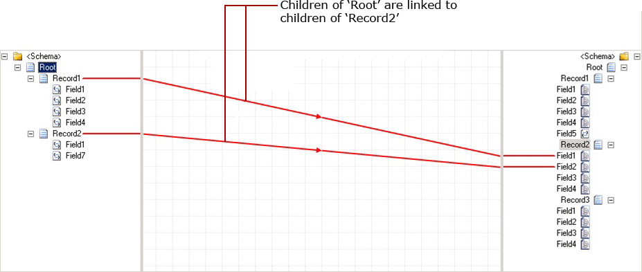
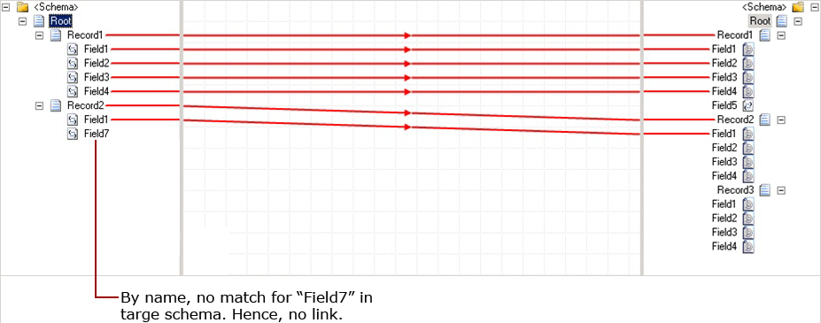
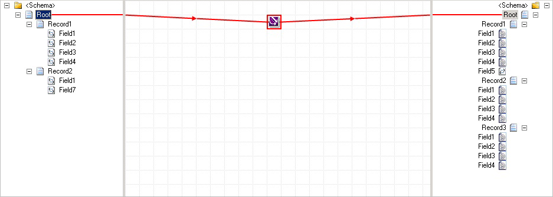

# How to Link Records Automatically
The BizTalk Mapper provides you with just-in-time assistance, through a shortcut menu, when you create links between two record elements of source and destination schemas. This topic provides information about how to use the shortcut menu to perform the linking operations.  
  
 You can create record-to-record links automatically in the following ways:  
  
- **Direct Link.** Using this technique, the BizTalk Mapper links the record from source schema to the selected record in the destination schema.  
  
- **Link by Structure.** Using this technique, the BizTalk Mapper attempts to match the **Record** and **Field** nodes within the **Record** nodes being linked according to the structures of those **Record** nodes, regardless of names of the corresponding nodes within those structures.  
  
- **Link By Name.** Using this technique, the BizTalk Mapper attempts to match the **Record** and **Field** nodes within the **Record** nodes being linked according to the names of the corresponding nodes, regardless of their structure, within the **Record** nodes being linked.  
  
- **Mass Copy.** The **Mass Copy** functoid enables your maps to use schemas that include **any** and **anyAttribute** elements. For information about the functoids available in BizTalk Mapper, see [Using Functoids to Create More Complex Mappings](../core/using-functoids-to-create-more-complex-mappings.md).  
  
  To use the shortcut menu, a link must originate from a sub-hierarchy parent node and must end on another sub-hierarchy parent node. The shortcut menu assists in what type of links should be created between the two schema nodes. The following is a list of options available on the shortcut menu.  
  
|Map from|Map to|Link Behavior|  
|--------------|------------|-------------------|  
|Field|Field|Direct link|  
|Record|Field|Direct link|  
|Field|Record|Direct link|  
|Record|Record|Shortcut menu appears|  
  
## Prerequisites  
 These operations require that the BizTalk Mapper is running.  
  
### To link the record elements directly  
  
1.  Drag the mouse from a sub-hierarchy parent node in source schema, and then drop it to the sub-hierarchy parent node in the target schema.  
  
2.  On the shortcut menu, click **Direct Link**. The following figure shows a direct link appearing from the selected source node to the target node.  
  
       
  
    > [!IMPORTANT]
    >  You can place a direct link from a sub-hierarchy parent node in source schema to a non-sub-hierarchy parent node in target schema. The following figure shows a direct link from “Root” that is a parent node in source schema to “Record1” that is a child to “Root” in target schema.  
  
       
  
### To link the record elements by structure  
  
1.  Drag the mouse from a sub-hierarchy parent node in source schema, and then drop it to the sub-hierarchy parent node in the target schema.  
  
2.  On the shortcut menu, click **Link by Structure**. The BizTalk Mapper matches the **Record** and **Field** nodes within the **Record** nodes being linked according to the structure of those **Record** nodes, regardless of names of the corresponding nodes within those structures.  
  
       
  
    > [!IMPORTANT]
    >  When you try to link a sub-hierarchy parent node in source schema to a non-sub-hierarchy parent node in target schema, by structure, the BizTalk Mapper maps the children of the source parent node to the children of the target parent node, respectively. The following figure shows the linking by structure.  
  
       
  
### To link the record elements by name  
  
1.  Drag the mouse from a sub-hierarchy parent node in source schema, and then drop it to the sub-hierarchy parent node in the target schema.  
  
2.  On the shortcut menu, click **Link by Name**. The BizTalk Mapper attempts to match the **Record** and **Field** nodes within the **Record** nodes being linked according to the names of the corresponding nodes, regardless of their structure, within the **Record** nodes to which you are linking.  
  
       
  
    > [!IMPORTANT]
    >  You can link a sub-hierarchy parent node in source schema to a non-sub-hierarchy parent node in target schema, by name. The BizTalk Mapper matches the names of the children of source node with the children of target node. If it finds identical children, then a link is established between the respective children. The following figure explains this concept.  
  
## To link using a mass copy functoid  
 The **Mass Copy** functoid enables your maps to use schemas that include **any** and **anyAttribute** elements. These elements are, in essence, wildcards provided in the XML Schema definition language to match unknown structures or attributes.  
  
 In addition to handling data with unknown structure, the **Mass Copy** functoid enables you to simplify schema development: only the portions of a schema that will be processed need to be specified in detail.  
  
   
  
 For more information about the **Mass Copy** functoid, see [Mass Copy Functoid](../core/mass-copy-functoid.md).  
  
## See Also  
 [Using Links to Specify Record and Field Mappings](../core/using-links-to-specify-record-and-field-mappings.md)   
 [How to Add Mass Copy Functoids to a Map](../core/how-to-add-mass-copy-functoids-to-a-map.md)