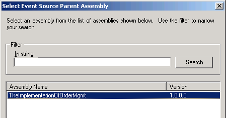

# How to Map Event Sources
You map event sources to gain access to data items that BAM tracks to generate alerts.  
  
> [!NOTE]
>  You can map data items from four different event source types: orchestration schedules, message payloads, context properties, or messaging properties. The procedure in this topic outlines mapping data items from an orchestration schedule.  
  
### To map an orchestration schedule as an event source  
  
1.  Open an existing tracking profile or create a new tracking profile. For more information about creating a tracking profile, see [How to Create a Tracking Profile](../core/how-to-create-a-tracking-profile.md).  
  
2.  Click the **Select Event Source** button (located above the right pane in the Tracking Profile Editor).  
  
3.  Select the **Select Orchestration Schedule** menu item from the cascading menu.  
  
4.  Select the parent assembly from which to draw the orchestration by clicking the assembly containing the orchestration in the **Assembly Name** list box, and then click **Next**.  
  
       
  
5.  Select the orchestration that is the source for the data items in the **Orchestration Names** list box, and then click **OK**.  
  
6.  Select the data items in the right pane and drag them to the appropriate nodes in the activity in the left pane.  
  
## See Also  
 [Tracking Profile Editor](../core/tracking-profile-editor.md)   
 [Creating Tracking Profiles](../core/creating-tracking-profiles.md)