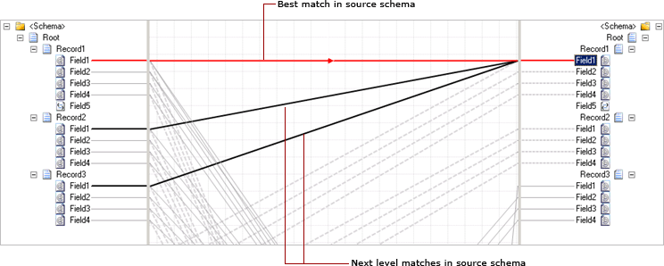

# How to Match Schema Nodes in a Map
When the source or destination schemas are complex, it can be difficult to map the elements. The BizTalk Mapper introduces the **Indicative Match** feature, which enables you to map complex schema elements by suggesting the best possible matches. This topic provides information about how to perform this operation.  
  
> [!NOTE]
>  The BizTalk Mapper suggests possible matches for a schema node. This feature is currently supported only for English names.  
  
## Prerequisites  
 These instructions require that the BizTalk Mapper is running.  
  
### To match relevant schema nodes  
  
1.  Select and right-click the schema element for which you need to know the best matches, and then click **Indicate Matches**. The BizTalk Mapper highlights the best matches (restricted to seven), with the most optimum match selected.  
  
     Alternatively, you can select **Indicate Matches** from the BizTalk menu, or press SHIFT + SPACE keys.  
  
     The following figure shows suggestive matches for the selected node in destination schema.  
  
       
  
    > [!NOTE]
    >  Hold down the SHIFT key to traverse among the suggestive matches.  
  
2.  You can now do the following:  
  
    -   Press ENTER to confirm the highlighted (best possible) match.  
  
    -   Use the UP/DOWN ARROW keys to cycle through the highlighted matches in the order of preference.  
  
        > [!NOTE]
        >  Press the DOWN ARROW key to traverse to the next best match, and the UP ARROW key highlights the previous best match.  
  
    -   Press the HOME key to return to the top match.  
  
## See Also  
 [Using Enhanced Features in BizTalk Mapper](../core/using-enhanced-features-in-biztalk-mapper.md)