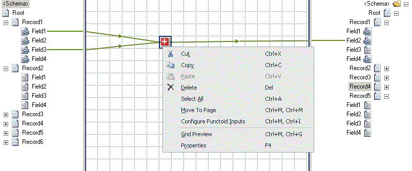
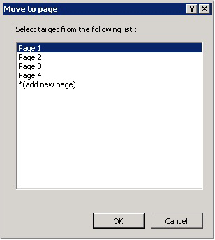
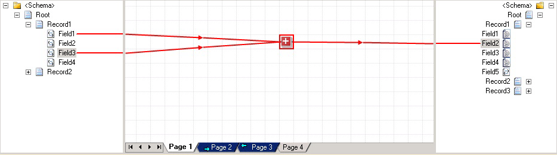

# How to Move a Relationship Between Grid Pages
Large maps include many sets of functoids and links, which can make it difficult for you to identify the links joining multiple functoids. In such a scenario, you might want to move a similar set of functoids and links to a different grid page to make the map more readable. This topic provides step-by-step instructions to perform the operation.  
  
 You can move a relationship from one grid page to another, in the same map only, in one of the following ways:  
  
-   Using the **Move to Page** dialog box  
  
-   Using the drag-and-drop of the ribbon-selected functoid(s) (and links)  
  
> [!IMPORTANT]
>  You can move one or more functoids and their links. When you move a relationship, the labels, comments, and the constant values (along with the correct place holders) associated with that relationship are retained.  
  
> [!IMPORTANT]
>  You cannot drag-and-drop only links to another grid page.  
  
## Prerequisites  
 These instructions require that BizTalk Mapper is running.  
  
### To move a relationship using Move To Page dialog box  
  
1.  On the map, select the grid page from which you want to move a relationship.  
  
2.  Right-click a functoid or a link in the relationship you want to move and then click **Move to Page**. A message saying that all the selected map items(s), along with related links and functoids, will be moved is displayed. Click **OK**.  
  
    > [!NOTE]
    >  To disable the message popup, in the Visual Studio menu, go to **Tools**, click **Options**, click **BizTalk Mapper**, click **General**, and then uncheck the **Move to page** option. For more information about general options, see [How to Customize General Settings in BizTalk Mapper](../core/how-to-customize-general-settings-in-biztalk-mapper.md).  
  
    > [!TIP]
    >  Alternatively, you can press CTRL+M, CTRL+M to open the **Move to Page** dialog box. For a list of Mapper shortcuts, see [BizTalk Mapper Keyboard Shortcuts](../core/biztalk-mapper-keyboard-shortcuts.md).  
  
       
  
3.  In the **Move to Page** dialog box, select the target grid page to which you want to move the relationship, and then click **OK**.  
  
    > [!NOTE]
    >  You can also create a new page by selecting **\*(add new page)**, and then clicking **OK**.  
  
    > [!NOTE]
    >  Alternatively, you can press CTRL+M, CTRL+A to add a new grid page in a map. For a list of Mapper shortcuts, see [BizTalk Mapper Keyboard Shortcuts](../core/biztalk-mapper-keyboard-shortcuts.md).  
  
       
  
     The selected functoid/link, along with the related functoids and links, is moved to the new grid page. The figure below shows the selected relationship (which was in Page 3) moved to Page 1.  
  
       
  
### To move a relationship using drag-and-drop  
  
1.  On the map, select the grid page from which you want to move a relationship.  
  
2.  Select the functoid(s) (and link(s)) you want to move to another grid page. This recursively selects all links that connect to the functoids in the selection.  
  
3.  Drag the selection to the page (on the page tab) where you want to move the relationship.  
  
    > [!WARNING]
    >  Do not release the mouse till you perform step 4.  
  
4.  When the target grid page comes into focus (in the above figure, Page 1 is in focus), drop the selection on an empty cell on the grid page. The selected relationship is moved to the new grid page.  
  
## See Also  
 [Working with Grid Pages](../core/working-with-grid-pages.md)