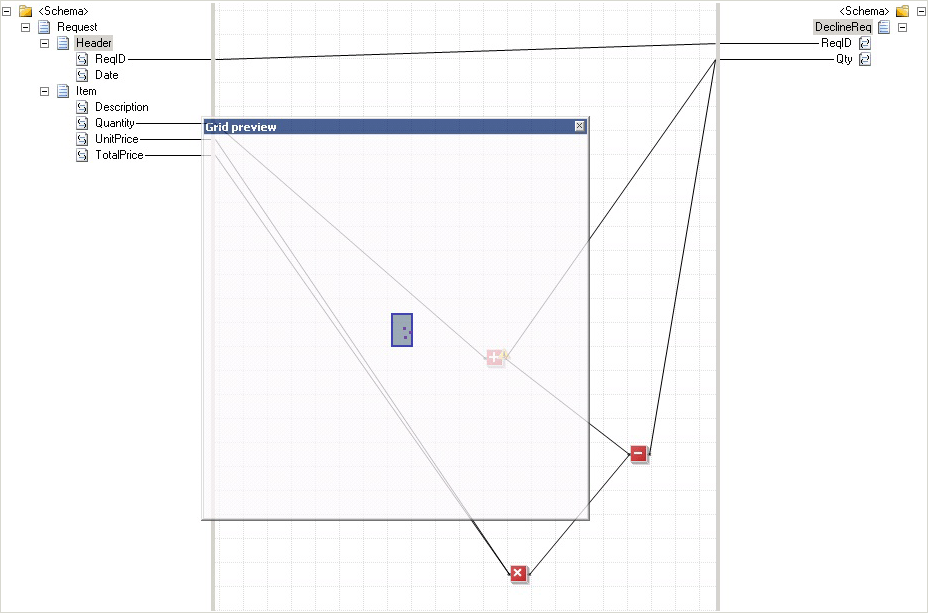

# How to Move Between and Within Grid Pages
If your map is complex, it is very likely that not all links and functoids are visible within a single grid page at the same time. This means that you need to be able to scroll within a grid page. And, if your map warrants multiple grid pages, you will need to be able to move between grid pages. This topic provides step-by-step instructions for these operations.  
  
## Prerequisites  
 These instructions require that BizTalk Mapper is running.  
  
### To pan within a grid page  
  
1.  On the mapper utility ribbon, click the  icon.  
  
2.  Hold the left mouse button, and then drag the mouse in the direction you want to scroll the map.  
  
    > [!NOTE]
    >  To switch to normal mode, click the  icon.  
  
## To scroll within a grid page using keyboard  
 Bring the grid page into focus by clicking anywhere on the grid surface. Then, use the LEFT, RIGHT, UP, or DOWN arrows on the keyboard to scroll the grid page in the direction that you want to. You can move only one grid cell at a time.  
  
 \- Or -  
  
 Bring the grid page into focus by clicking anywhere on the grid surface. Then, use the Page Up/ Page Down keys on the keyboard to scroll the grid page.  
  
## To scroll within a grid page using mouse  
 Move the mouse pointer over the grid page, and rotate the mouse scroll wheel to move the map up or down.  
  
> [!NOTE]
>  You cannot use the mouse to move right or left on the map.  
  
 Alternatively, you can move the mouse pointer to the edge or corner of the grid page in the direction that you want to scroll. The cursor changes to an arrow. Click and hold the left mouse button to navigate within the grid page.  
  
### To scroll within a grid page by using the grid preview  
  
1.  On the **BizTalk** menu, click **Grid Preview**.  
  
    > [!NOTE]
    >  You can also right-click in the grid page background, and then click **Grid Preview** from the shortcut menu. Alternatively, you can also press CTRL+M, CTRL+G from the keyboard. For a list of Mapper keyboard shortcuts, see [BizTalk Mapper Keyboard Shortcuts](../core/biztalk-mapper-keyboard-shortcuts.md).  
  
2.  In the **Grid Preview** dialog box, drag the locator square to a new location. As you move the locator square, the displayed grid page scrolls accordingly.  
  
    > [!NOTE]
    >  The grid preview is useful for navigating large grid pages with many functoids and links spread over a large area.  
  
       
  
## To zoom the grid page  
 Drag the zoom slider to shrink or enlarge the grid page you are working on. You can zoom out to see the complete grid page in a small enough size for it to fit in. Conversely, you can zoom in to get a close-up view of a part of the grid page.  
  
   
  
### To move between grid pages  
  
1.  Use the **Move to Left End**, **Move Left**, **Move Right**, and **Move to Right End** arrows at the bottom of the grid to display the tab that shows the name of the grid page to which you want to move.  
  
       
  
2.  Click the tab of the grid page to which you want to move.  
  
    > [!TIP]
    >  Alternatively, you can right-click anywhere in the region where the **Move to Left End**, **Move Left**, **Move Right**, and **Move to Right End** arrows are displayed. From the context menu, click the page you want to move to.  
  
## See Also  
 [Working with Grid Pages](../core/working-with-grid-pages.md)
