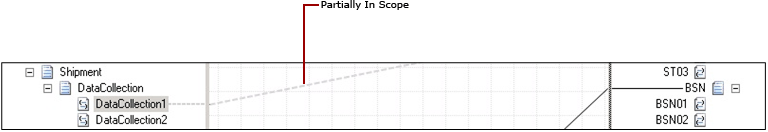
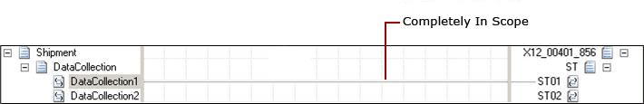
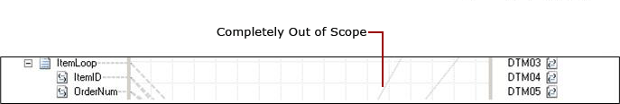

# How to Optimize the Display of Links
When the schemas are big, your maps might include a large number of links between the source and the destination schemas. With many links across the map surface, you may find it difficult to track a link or an object you need to work on. Also, it can be difficult for you to track an end-to-end relationship between a source schema, the links, the functoids, and the destination schema. In the BizTalk Mapper, you can better manage complex and large schemas, and bring out an optimized display of links in the map. This topic provides details about how to view links.  
  
 You can categorize the links as follows:  
  
-   Partially in scope  
  
-   Completely in scope  
  
-   Completely out of scope  
  
## Prerequisites  
 These instructions require that BizTalk Mapper is running.  
  
## To view the links partially in scope  
 Links that have at least one end visible on the grid surface are called “partially in scope.”  
  
 The figure below shows a link that is “partially in scope.” These links are shown as dashed lines on the grid page.  
  
 Click the link that is partially visible on the grid surface, and the grid page automatically moves up/down to bring the relationship into the current view.  
  
   
  
## To view the links completely in scope  
 A link that has both ends (node to node, node to functoid, functoid-to-functoid, or functoid to node) visible on the grid surface is called “completely in scope.”  
  
 The figure below shows a link between “DataCollection1” and “ST01” that is completely in scope.  
  
 Click the link, and the relationship from source node to target node is selected.  
  
   
  
## To view the links completely out of scope  
 A link that has neither of its end points visible in the current map view is called “completely out of scope.”  
  
 The figure below shows a link that is completely out of scope.  
  
 If you do not want to display these links on the map surface (because none of the links are visible), you may choose to turn them off by clicking  on the Mapper utility ribbon. This reduces the amount of links that are visible on the grid view.  
  
   
  
## See Also  
 [Using Enhanced Features in BizTalk Mapper](../core/using-enhanced-features-in-biztalk-mapper.md)
