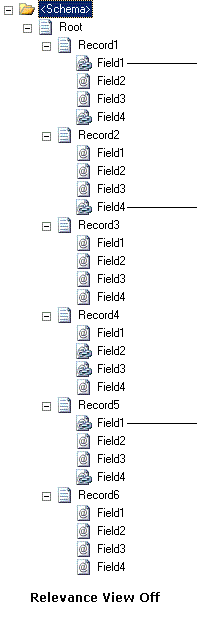
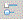
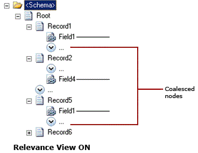

# How to Optimize the Schema Tree View
You can use the **Relevance View** in BizTalk Mapper to optimize the source and/or target schema trees. This topic provides instructions about how to perform the operation.  
  
 The relevance view uses sibling coalescence to collapse the non-relevant schema elements to provide a more compact view of the schema. This further reduces the need of scrolling and helps you focus on your requirement for using schemas and maps.  
  
 The following figure shows a schema when the relevance view is turned OFF. The schema pane displays all nodes, irrespective of whether the nodes are part of any relationship or not.  
  
   
  
 Click the  icon on the Mapper utility ribbon to turn the relevance view ON. You can switch to relevance view for any one or both the source schema and the target schema; click the respective icons for source and target schemas.  
  
 When you switch to relevance view for a schema:  
  
-   All the record elements that do not have any links either for them or their child field elements are collapsed.  
  
-   All successive nodes that do not have any links are coalesced and are replaced by the  icon. The BizTalk Mapper looks for a minimum of two successive non-relevant nodes that can be coalesced. You can move the mouse over the icon to view the list of coalesced nodes. Note that the infotip will only list the names of the first three coalesced nodes, even if there are more coalesced nodes. You can view all the nodes by clicking the  icon.  
  
    > [!NOTE]
    >  For more information about infotip, see [How to View Infotip and Tooltip](../core/how-to-view-infotip-and-tooltip.md).  
  
## Prerequisites  
 This operation requires that BizTalk Mapper is running.  
  
## To optimize the schema tree view  
 On the Mapper utility ribbon, turn ON the relevance view for source and/or target schemas by clicking the respective  icons. The following figure shows the same schema when the relevance view is turned ON. All the non-relevant nodes are replaced by the  icon to provide a more compact view of the schema.  
  
   
  
 When you expand the coalesced nodes in source and/or destination schemas, the  changes to  icon.  
  
> [!NOTE]
>  You can press CTRL+M, CTRL+E or CTRL+M, CTRL+C to expand or collapse the tree nodes in source schema respectively. Similarly, you can press CTRL+M, CTRL+E or CTRL+M, CTRL+C to expand or collapse the tree nodes in destination schema respectively. You can also press Ctrl+M, Ctrl+H or Ctrl+M, Ctrl+D for source or target coalescing respectively. For a list of Mapper keyboard shortcuts, see [BizTalk Mapper Keyboard Shortcuts](../core/biztalk-mapper-keyboard-shortcuts.md).  
  
## See Also  
 [Using Enhanced Features in BizTalk Mapper](../core/using-enhanced-features-in-biztalk-mapper.md)
