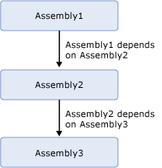

# How to Redeploy a BizTalk Assembly from Visual Studio
In the process of developing an assembly, you often need to deploy, test, modify, and redeploy it repeatedly. In previous versions of [!INCLUDE[btsBizTalkServerNoVersion](../includes/btsbiztalkservernoversion-md.md)], if you wanted to redeploy an assembly without changing the version number, you first needed to manually stop, unenlist, and unbind artifacts contained in the assembly in [!INCLUDE[btsBizTalkServerNoVersion](../includes/btsbiztalkservernoversion-md.md)] and then remove the assembly from the BizTalk Management (configuration) database. In addition, after redeploying the assembly, you needed to bind, enlist, and start its artifacts in [!INCLUDE[btsBizTalkServerNoVersion](../includes/btsbiztalkservernoversion-md.md)].  
  
 With BizTalk Server, however, when you enable the Redeploy option in [!INCLUDE[btsVStudioNoVersion](../includes/btsvstudionoversion-md.md)], [!INCLUDE[btsBizTalkServerNoVersion](../includes/btsbiztalkservernoversion-md.md)] automatically takes all of the steps to redeploy the assembly for you. Although you can redeploy an assembly from the project level (such as by right-clicking the project in Solution Explorer and clicking Deploy) to redeploy an individual assembly, we strongly recommend that you always redeploy assemblies from the solution level (such as by right-clicking the solution and clicking Deploy). This redeploys all of the assemblies in the solution at once and handles all of the steps involved when there are dependencies, as described later.  
  
> [!IMPORTANT]
>  Although there are rare situations in which you might need to redeploy at the project level, as a rule you should always redeploy at the solution level.  
  
 When redeploying an assembly, bear in mind the following important points:  
  
- **You must install the new assembly in the GAC.** When you redeploy an assembly, you must always install the new version of the assembly in the GAC, as described in [How to Install an Assembly in the GAC](../core/how-to-install-an-assembly-in-the-gac.md). You can do this after you redeploy it.  
  
- **You should always redeploy at the solution level when there are dependencies.** If you have multiple assemblies in a solution, and one or more assemblies in the solution has a dependency on the assembly that you want to redeploy, you should redeploy your assemblies at the solution level. This is because when you redeploy an assembly at the project level, [!INCLUDE[btsBizTalkServerNoVersion](../includes/btsbiztalkservernoversion-md.md)] will stop, unenlist, unbind, and remove the artifacts in all assemblies that either depend on this assembly on upon which this assembly depends. [!INCLUDE[btsBizTalkServerNoVersion](../includes/btsbiztalkservernoversion-md.md)] will not take the additional steps to deploy, bind, enlist, and start the artifacts. When you redeploy the entire solution, however, [!INCLUDE[btsBizTalkServerNoVersion](../includes/btsbiztalkservernoversion-md.md)] automatically takes the steps required to undeploy and redeploy all of the artifacts in the solution based on their dependencies.  
  
- **You may need to manually redeploy dependent assemblies.** [!INCLUDE[btsBizTalkServerNoVersion](../includes/btsbiztalkservernoversion-md.md)] always undeploys dependent assemblies, but in the following cases, you must take the additional steps to deploy, bind, and enlist the artifacts in each dependent assembly after redeploying the assembly on which the assembly depends:  
  
  - If you redeploy an assembly at the project level and another assembly in the same solution depends on it.  
  
  - If you redeploy an assembly at the solution level, but a dependent assembly exists in a different solution.  
  
    For example, if you were to redeploy only Assembly 3 shown in the following diagram, following redeployment you would need to deploy, bind, and enlist the artifacts in Assembly 2, and then deploy, bind, and enlist the artifacts in Assembly 1.  
  
      
  
    An alternative approach is to avoid unnecessary deployment of core assemblies that have not changed.  For example in the diagram above, if there are other assemblies that depend on Assembly 2 and Assembly 3 and neither of these assemblies have been updated.  Uncheck the **Deploy** option in configuration manager for the Assembly 2 and the Assembly 3 projects. This way external assemblies that depended on them will not be undeployed requiring redeployment. For more information, see [How to Set Deployment Properties in Visual Studio](../core/how-to-set-deployment-properties-in-visual-studio.md).  
  
- **You must restart host instances.** When you redeploy an assembly that contains an orchestration without changing the assembly version number, the existing assembly is overwritten in the BizTalk Management database. Before the change will take effect, however, you must restart each host instance of the host to which the orchestration is bound. You can specify the option that all host instances on the local computer restart automatically when you redeploy an assembly. For instructions, see [How to Set Deployment Properties in Visual Studio](../core/how-to-set-deployment-properties-in-visual-studio.md). You can also manually stop and start each host instance, as described in [How to Stop a Host Instance](../core/how-to-stop-a-host-instance.md) and [How to Start a Host Instance](../core/how-to-start-a-host-instance.md).  
  
> [!IMPORTANT]
>  Because the Redeploy option bypasses version control, we recommend that you use it only during development.  
  
## Prerequisites  
 To perform the procedure in this topic, you must be logged on with an account that is a member of the [!INCLUDE[btsBizTalkServerNoVersion](../includes/btsbiztalkservernoversion-md.md)] Administrators group. In addition, your account must have Read/Write permissions on the local file system and the global assembly cache (GAC). The Administrators account on the local computer has these permissions.  
  
## To redeploy a BizTalk solution  
  
#### Using Visual Studio Solution Explorer  
  
1. Ensure that the Redeploy option is enabled in Deployment properties for each project in the solution, as described in [How to Set Deployment Properties in Visual Studio](../core/how-to-set-deployment-properties-in-visual-studio.md). This option is enabled by default.  
  
2. In [!INCLUDE[btsVStudioNoVersion](../includes/btsvstudionoversion-md.md)] Solution Explorer, right-click a BizTalk solution, and then click **Deploy**.  
  
    The assemblies in the solution are deployed into the specified BizTalk application. The status of the build and deployment process displays in the lower left corner of the page.  
  
#### Using the Visual Studio command prompt  
  
1.  Ensure that the Redeploy option is enabled in Deployment properties for each project in the solution, as described in [How to Set Deployment Properties in Visual Studio](../core/how-to-set-deployment-properties-in-visual-studio.md). This option is enabled by default.  
  
2.  Start **Visual Studio Command Prompt**.  
  
3.  Type the following command, substituting the appropriate values, as described in the following table:  
  
     **devenv /deploy**  *SolnConfigName* *SolutionName*  
  
     Example:  
  
     **devenv /deploy Release "C:\Documents and Settings\someuser\My Documents\Visual Studio\Projects\MySolution\MySolution.sln"**  
  
    |Parameter|Value|  
    |---------------|-----------|  
    |**/deploy**|Deploys a solution after a build or rebuild.|  
    |*SolnConfigName*|Name of the solution configuration that will be used to build the solution named in SolutionName.|  
    |*SolutionName*|Full path and name of the solution file.|  
  
## See Also  
 [Deploying BizTalk Assemblies from Visual Studio into a BizTalk Application](../core/deploying-biztalk-assemblies-from-visual-studio-into-a-biztalk-application.md)