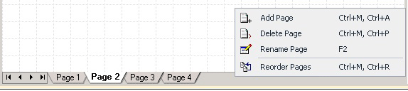
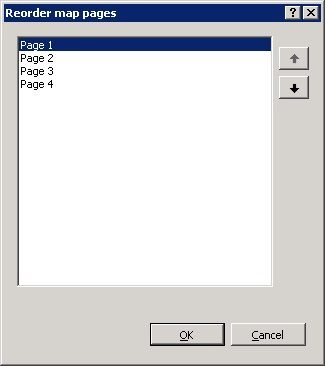

# How to Reorder Grid Pages
If your map is complex, you can include multiple grid pages, and then rename and reorder them. This topic includes step-by-step instructions to perform these operations.  
  
 You can include one or more grid pages to simplify the view of your map, and also to keep it organized and readable. For example, you can put all the links and functoids that relate to header information on one page, and then put all the links and functoids that relate to the body of your map on another page. You can then rename and reorder the grid pages that you have created.  
  
## Prerequisites  
 These instructions require that BizTalk Mapper is running.  
  
### To add and rename a grid page  
  
1.  Right-click the page tabs panel, and then click **Add Page**. You will see a new page inserted in your map.  
  
       
  
2.  Right-click the page tabs panel, and then click **Rename Page**.  
  
    > [!TIP]
    >  Alternatively, you can either double-click the existing page tab or press F2 on the keyboard.  
  
3.  Type the new name for the grid page, and then press ENTER.  
  
### To reorder grid pages using Reorder map pages dialog box  
  
1.  Right-click the page tabs panel, and then click **Reorder Pages**.  
  
2.  In the **Reorder map pages** dialog box, select the page tab you want to move, and click the UP arrow or the DOWN arrow to change the relative position of the grid page, and then click **OK**.  
  
       
  
### To reorder grid pages using the page tabs panel  
  
1.  Select the page tab you want to move/reorder.  
  
2.  Hold down the mouse key and move it along the page tabs panel.  
  
3.  Release the mouse when you have brought the page tab to the desired location on the page tab panel.  
  
    > [!TIP]
    >  The page is moved/reordered only when the mouse cursor changes into a vertical line between two page tabs. The vertical line indicates the position of the page to be reordered.  
  
### To delete a grid page  
  
1.  Select the tab of the page you want to delete.  
  
2.  Right-click on the page tab, and then click **Delete Page**. The page is deleted silently.  
  
    > [!IMPORTANT]
    >  If you do not want to delete the grid page, press CTRL + Z to undo the deletion operation. For more information on how to undo or redo user operations, see [How to Undo or Redo User Operations](../core/how-to-undo-or-redo-user-operations.md).  
  
## See Also  
 [Working with Grid Pages](../core/working-with-grid-pages.md)
