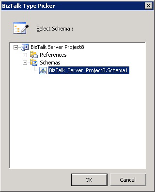

# How to Replace Schemas
There may be times when you want to replace either the source or destination schema in an existing map, such as when you receive an updated schema from a trading partner.  
  
> [!NOTE]
>  The BizTalk Mapper attempts to maintain all existing links between the retained schema and the replaced schema.  
  
## Replace a source or destination schema  
  
1. Right-click either the source or destination schema tree view, and then select **Replace Schema**.  
  
   > [!NOTE]
   >  Alternatively, you can also press CTRL+M, CTRL+S from the keyboard. For a complete list of Mapper keyboard shortcuts, see [BizTalk Mapper Keyboard Shortcuts](../core/biztalk-mapper-keyboard-shortcuts.md).  
  
2. In the **BizTalk Type Picker** dialog box, expand the **Schemas** node in the tree, select the appropriate schema, and then select **OK**.  
  
      

   > [!TIP]
   > **Starting with [!INCLUDE[bts2016_md](../includes/bts2016-md.md)]**, you can resize the Type Picker window to see the full name of your schema.
      
    If only a single root exists in the replacement schema, or a root node has been established for the replacement schema using the **Root Reference** property of the **Schema** node, the replacement schema opens in the relevant pane, and you will not need to perform step 3.  
  
3. If multiple root nodes exist in the destination schema, and no root node has been established for the destination schema using the **Root Reference** property of the **Schema** node, in the **Root Node for \<*Source/Target*\> Schema** dialog box, select the appropriate root node, and then select **OK**.  
  
    The replacement schema opens in the relevant pane.  
  
   > [!NOTE]
   >  While replacing schema, if relevant records/fields are not found, some links may get lost. The schema is replaced only when you select **Yes** on the **Confirmation**  dialog box.  
  
## See Also  
 [Managing Maps Within Projects](../core/managing-maps-within-projects.md)