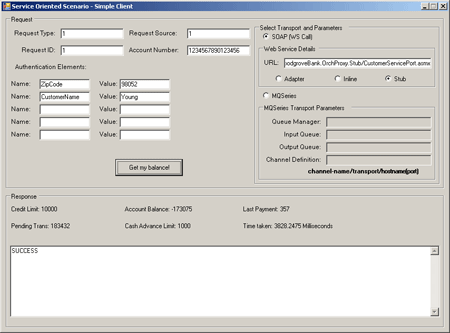
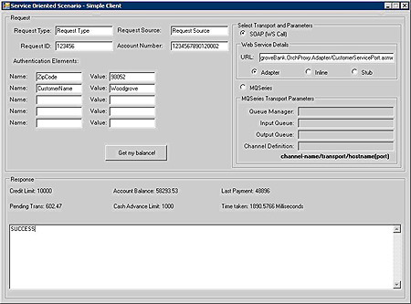
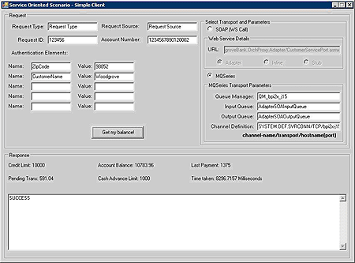
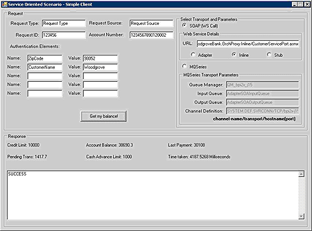
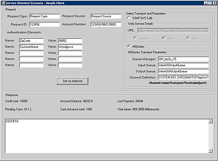

# How to Run the Service Oriented Solution
The following steps describe how to run and validate the service oriented solution on a single computer. After starting the Payment Tracker simulator, you can send requests using either the SOAP or MQSeries transport (with separate procedures for the adapter and inline versions of the service oriented solution).  
  
-   [Send requests by SOAP transport using the client application (stub version)](#step1)  
  
-   [Send requests using the client application (adapter version)](#step3)  
  
-   [Send requests using the client application (inline version)](#step5)  
  
##   Send requests by SOAP transport using the client application (stub version)  
  
#### To send requests by SOAP transport using the client application (stub version)  
  
1.  Open a command prompt, change the directory to the \<*BizTalk Server install Directory*\>\SDK\Scenarios\SO\BTSSoln\SimpleClient\bin\Release, and then run the BTSScnSOSimpleClient.exe.  
  
2.  Type any characters in the **RequestType**, **RequestSource**, and **RequestID** text boxes.  
  
3.  Type any 16-digit number in the **Account Number** text box.  
  
4.  Select **SOAP (WS Call)** and **Stub** in the **Select Transport and Parameters** group box.  
  
5.  Type the following URL in the **URL** text box, for example:  
  
6.  `http://localhost/Microsoft.Samples.BizTalk.WoodgroveBank.OrchProxy.Stub/CustomerServicePort.asmx`  
  
7.  Type `ZipCode` in the **Name** text box under **Authentication Elements**, and then type any characters in the **Value** text box.  
  
8.  Type `CustomerName` in the **Name** text box under **Authentication Elements**, and then type any characters in the **Value** text box.  
  
9. Click **Get my balance**.  
  
10. The response is displayed in the **Response** text box: **SUCCESS** appears if the request is handled successfully; an error message appears if the request fails.  
  
       
  
##   Send requests using the client application (adapter version)  
  
#### To send requests using the client application (adapter version)  
  
1.  Open a command prompt, change the directory to \<*BizTalk Server install Directory*\>\SDK\Scenarios\SO\BTSSoln\PaymentTracker\bin\Debug and, then run the following command to start the PaymentTracker simulator:  
  
     `BTSScnSOPaymentTracker.exe LastPaymentsInputQueue LastPaymentsOutputQueue <` *Queue Manager Name* `> 5 [<` *Channel Definition* `>]`  
  
    > [!NOTE]
    >  The channel definition is optional if it is not remote MQSeries Server.  
  
    -   Leave the Payment Tracker simulator running.  
  
2.  Open a command prompt, change the directory to the \<*BizTalk Server install Directory*\>\SDK\Scenarios\SO\BTSSoln\SimpleClient\bin\Release, and then run the BTSScnSOSimpleClient.exe.  
  
3.  In the BTSScnSOSimpleClient.exe, send a request by SOAP transport using the as follows:  
  
    1.  Type any characters in the **RequestType**, **RequestSource**, and **RequestID** text boxes.  
  
    2.  Type any 16-digit number in the **Account Number** text box.  
  
    3.  Select **SOAP (WS Call)** and **Adapter** in the **Select Transport and Parameters** group box.  
  
    4.  Type the following URL in the **URL** text box, for example:  
  
         `http://localhost/Microsoft.Samples.BizTalk.WoodgroveBank.OrchProxy.Adapter/CustomerServicePort.asmx`  
  
    5.  Type `ZipCode` in the **Name** text box under **Authentication Elements**, and then type any characters in the **Value** text box.  
  
    6.  Type `CustomerName` in the **Name** text box under **Authentication Elements**, and then type any characters in the **Value** text box.  
  
    7.  Click **Get my balance**.  
  
    8.  The response is displayed in the **Response** text box: **SUCCESS** appears if the request is handled successfully; an error message appears if the request fails.  
  
           
  
4.  In the BTSScnSOSimpleClient.exe, send requests by MQSeries transport as follows:  
  
    1.  Type any characters in the **RequestType**, **RequestSource**, and **RequestID** text boxes.  
  
    2.  Type a 16-digit number in the **Account Number** text box.  
  
    3.  Select **MQSeries** in the **Select Transport and Parameters** group box.  
  
    4.  Type \<*Queue Manager Name*\> in the **Queue Manager** text box. QM_\<*Your Computer Name*\> is the default value for \<*Queue Manager Name*\>.  
  
    5.  Type `AdapterSOAInputQueue` in the **Input Queue** text box.  
  
    6.  Type `AdapterSOAOutputQueue` in the **Output Queue** text box.  
  
    7.  Type \<*Channel Definition*\> in the **Channel Definition** box. S_\<*Your Computer Name*\>/TCP/\<*Your Computer Name*\>(1414) is the default value for \<*Channel Definition*\>.  
  
    8.  Type `ZipCode` in the **Name** text box under **Authentication Elements**, and then type any characters in the **Value** text box.  
  
    9. Type `CustomerName` in the **Name** text box under **Authentication Elements**, and then type any characters in the **Value** text box.  
  
    10. Click **Get my balance**.  
  
    11. The response is displayed in the **Response** text box: **SUCCESS** appears if the request is handled successfully; an error message appears if the request fails.  
  
           
  
##   Send requests using the client application (inline version)  
  
#### To send requests using the client application (inline version)  
  
1.  Open a command prompt, change the directory to \<*BizTalk Server install Directory*\>\SDK\Scenarios\SO\BTSSoln\PaymentTracker\bin\Debug, and then run the following command to start the PaymentTracker simulator:  
  
     `BTSScnSOPaymentTracker.exe LastPaymentsInputQueue LastPaymentsOutputQueue <` *Queue Manager Name* `> 5 [<` *Channel Definition* `>]`  
  
    > [!NOTE]
    >  The channel definition is optional if it is not remote MQSeries Server.  
  
    > [!NOTE]
    >  Skip this step if the PaymentTracker simulator is already running.  
  
    -   Leave the Payment Tracker simulator running.  
  
2.  In the **BizTalk Server Administration Console**, expand **BTSScn.SO.CustomerService**, click **Receive Locations**, right-click **PaymentTrackingSystemOutputQueue** in the right pane, and then click **Disable**.  
  
    > [!NOTE]
    >  The adapter version and inline version uses the same MQSeries queue, LastPaymentsOutputQueue. To avoid the race condition between two versions, disable the adapter version's receive location listening on the MQSeries queue.  
  
3.  Open a command prompt, change the directory to the \<*BizTalk Server install Directory*\>\SDK\Scenarios\SO\BTSSoln\SimpleClient\bin\Release, and then run the BTSScnSOSimpleClient.exe.  
  
4.  In the BTSScnSOSimpleClient.exe, send a request by SOAP transport using the as follows:  
  
    1.  Type any characters in the **RequestType**, **RequestSource**, and **RequestID** text boxes.  
  
    2.  Type any 16-digit number in the **Account Number** text box.  
  
    3.  Select **SOAP (WS Call)** and **Inline** in the **Select Transport and Parameters** group box.  
  
    4.  Type the following URL in the **URL** text box, for example:  
  
         `http://localhost/Microsoft.Samples.BizTalk.WoodgroveBank.OrchProxy.Inline/CustomerServicePort.asmx`  
  
    5.  Type `ZipCode` in the **Name** text box under **Authentication Elements**, and then type any characters in the **Value** text box.  
  
    6.  Type `CustomerName` in the **Name** text box under **Authentication Elements**, and then type any characters in the **Value** text box.  
  
    7.  Click **Get my balance**.  
  
    8.  The response is displayed in the **Response** text box: **SUCCESS** appears if the request is handled successfully; an error message appears if the request fails.  
  
           
  
5.  In the BTSScnSOSimpleClient.exe, send requests by MQSeries transport as follows:  
  
    1.  Type any characters in the **RequestType**, **RequestSource**, and **RequestID** text boxes.  
  
    2.  Type a 16-digit number in the **Account Number** text box.  
  
    3.  Select **MQSeries** in the **Select Transport and Parameters** group box.  
  
    4.  Type \<*Queue Manager Name*\> in the **Queue Manager** text box. QM_\<*Your Computer Name*\> is the default value for \<*Queue Manager Name*\>.  
  
    5.  Type `InlineSOAInputQueue` in the **Input Queue** text box.  
  
    6.  Type `InlineSOAOutputQueue` in the **Output Queue** text box.  
  
    7.  Type \<*Channel Definition*\> in the **Channel Definition** box. S_\<*Your Computer Name*\>/TCP/\<*Your Computer Name*\>(1414) is the default value for \<*Channel Definition*\>.  
  
    8.  Type `ZipCode` in the **Name** text box under **Authentication Elements**, and then type any characters in the **Value** text box.  
  
    9. Type `CustomerName` in the **Name** text box under **Authentication Elements**, and then type any characters in the **Value** text box.  
  
    10. Click **Get my balance**.  
  
    11. The response is displayed in the **Response** text box: **SUCCESS** appears if the request is handled successfully; an error message appears if the request fails.  
  
           
  
## See Also  
 [Before Installing the Service Oriented Solution](../core/before-installing-the-service-oriented-solution.md)   
 [How to Install the Stub Version of the Service Oriented Solution](../core/how-to-install-the-stub-version-of-the-service-oriented-solution.md)   
 [How to Install the Inline and Adapter Versions of the Service Oriented Solution](../core/how-to-install-the-inline-and-adapter-versions-of-the-service-oriented-solution.md)   
 [Developer Machine Setup for the Service Oriented Solution](../core/developer-machine-setup-for-the-service-oriented-solution.md)
