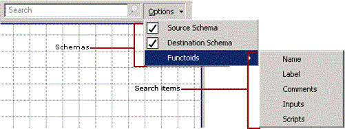
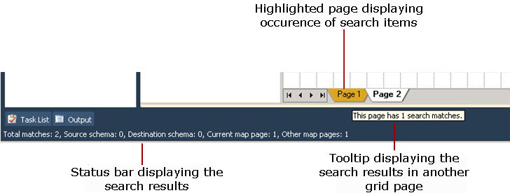

# How to Search for Map Items
The BizTalk Mapper enables you to search for items in the source schema, the destination schema, and the grid surface. This topic provides information about how to perform this operation.  
  
## Prerequisites  
 These instructions require that BizTalk Mapper is running.  
  
## To search for items  
 Select the schema where you want to search. If you select source schema, the BizTalk Mapper searches and looks for the match only in the source schema. However, you can select both source and destination schemas.  
  
> [!NOTE]
>  To confirm selection, look for the mark before the schema or the schema item.  
  
   
  
 In the **Search** box on the Mapper utility ribbon, type the name of the item you want to search. You can search for a string in the name of a node in the source or destination schema, as well as in the name, label, comment, inputs, or scripts for functoids.  
  
 As you enter the search string, the objects that meet the search criteria are highlighted. You can then traverse through the search results either using the arrow keys on the keyboard or the  and  icons on the utility ribbon. If the search results are spread across all three views, the search results are traversed in the order of the source schema, relationship view, and the destination schema. After going through the search results, you can close the search either by deleting the search string or by clicking the () icon next to the search string.  
  
> [!NOTE]
>  You can also press CTRL+M, CTRL+J or CTRL+M, CTRL+K to traverse through the search results upwards or downwards, respectively. For a list of Mapper keyboard shortcuts, see [BizTalk Mapper Keyboard Shortcuts](../core/biztalk-mapper-keyboard-shortcuts.md).  
  
> [!IMPORTANT]
>  If the search results for the relationship view are not visible in a single map view, the BizTalk Mapper displays blinking arrows in the direction where there are additional hits. For example, the top arrow icon () denotes that there are additional search results that can be viewed by scrolling up. Similarly, if there are search results in different map pages, the page tabs for those pages are highlighted, in yellow. On moving the mouse over the highlighted page, the tooltip displays the number of search matches on that page. The status bar displays the search results.  
  
   
  
## See Also  
 [Using BizTalk Mapper](../core/using-biztalk-mapper.md)
