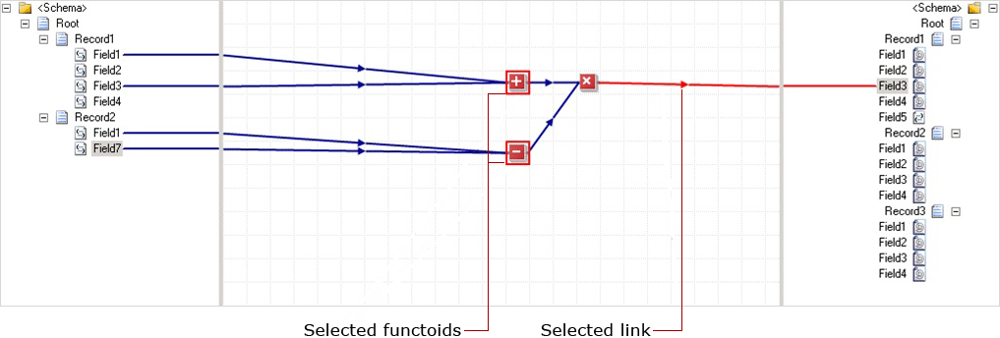
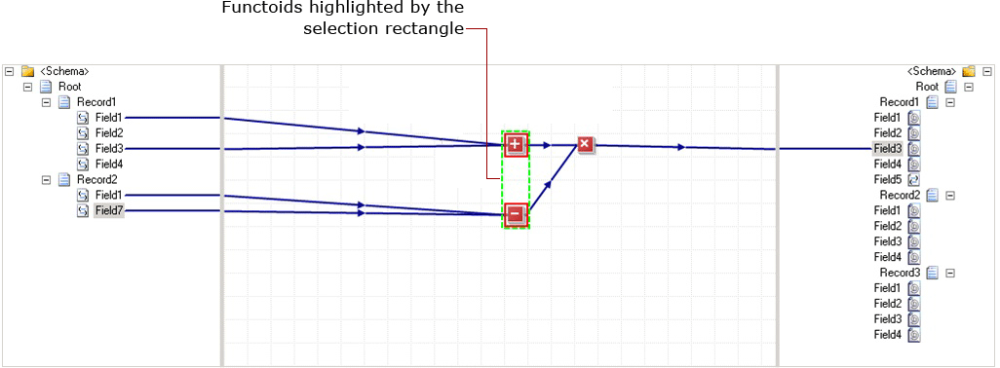

# How to Select Multiple Links and Functoids
When you want to perform a similar operation on a group of functoids and/or links in a map, you can select that group of functoids and/or links all at the same time. This topic provides information about how to perform this operation.  
  
## Prerequisites  
 These instructions require that BizTalk Mapper is running.  
  
## Why do you need to bulk-select links/functoids?  
 You can bulk-select links and/or functoids to do any of the following:  
  
-   Copy/cut and paste the selection in the same grid page or another grid page in the same map.  
  
    > [!NOTE]
    >  For information on how to copy, cut, and paste links and functoids, see [How to Copy, Cut, and Paste Links and Functoids](../core/how-to-copy-cut-and-paste-links-and-functoids.md).  
  
-   Move the selection between grid pages  
  
    > [!NOTE]
    >  For information on how to move a relationship from one grid page to another, see [How to Move a Relationship Between Grid Pages](../core/how-to-move-a-relationship-between-grid-pages.md).  
  
-   Edit the common properties of functoids and links in the selection  
  
    > [!NOTE]
    >  For information on how to set comments and labels for functoids and links, see [How to Label a Link](../core/how-to-label-a-link.md) or [How to Label and Comment a Functoid](../core/how-to-label-and-comment-a-functoid.md).  
  
-   Deleting multiple link(s) and/or functoid(s) in one step  
  
    > [!NOTE]
    >  For information on how to delete functoids, see [How to Delete Functoids](../core/how-to-delete-functoids.md).  
  
## To select multiple links and functoids  
 You can bulk-select functoids and/or links in any of the following ways:  
  
-   Click the link or the functoid. Hold down the CTRL key, and then click the other links and/or functoids you want to select.  
  
     The following figure shows the selected functoids and links highlighted.  
  
       
  
-   Drag the mouse on the map surface. The functoids under the selection rectangle are highlighted.  
  
       
  
-   You can use a combination of dragging and CTRL-click. Drag the mouse on the map surface and select the functoids and/or links in that range. Hold down the CTRL key, and then click the functoids and/or links outside the selection range.  
  
## To select all links and functoids on the grid page  
 You can select all the functoids and links on the Mapper grid page in any of the following ways:  
  
-   Right-click anywhere on the grid page and click **Select All**.  
  
-   Click anywhere on the grid page and click press CTRL+A from the keyboard.  
  
-   Click anywhere on the grid page. From the Visual Studio menu, click **Edit**, and then click **Select All**.  
  
## See Also  
 [Using Links to Specify Record and Field Mappings](../core/using-links-to-specify-record-and-field-mappings.md)