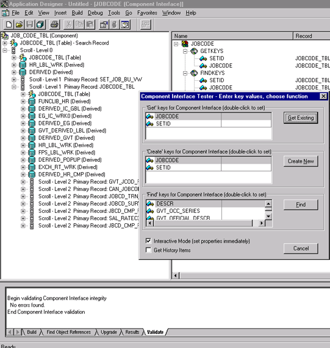
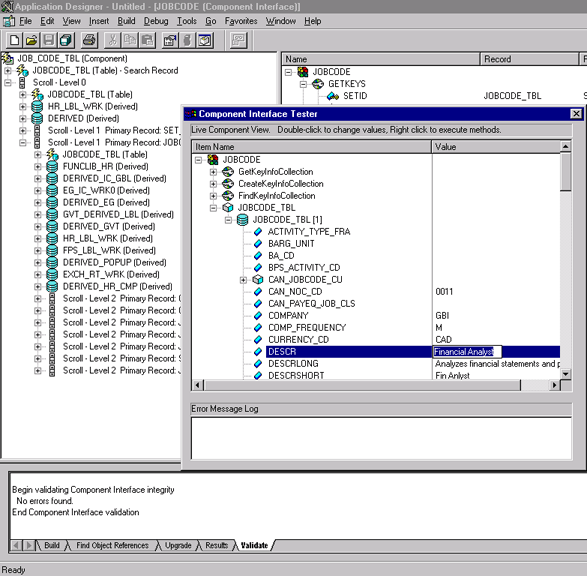
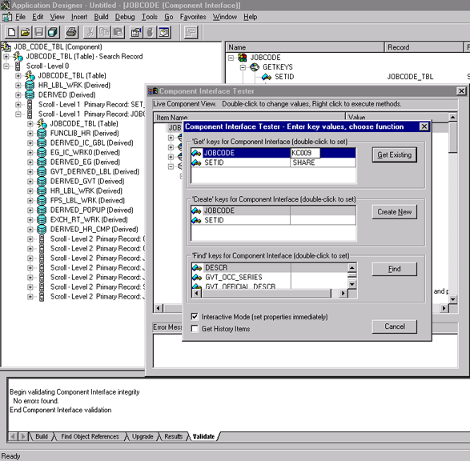
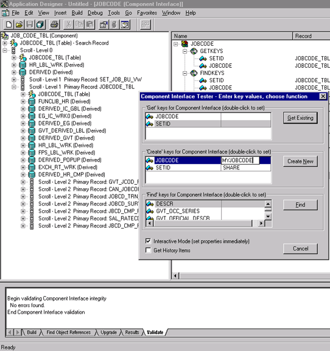
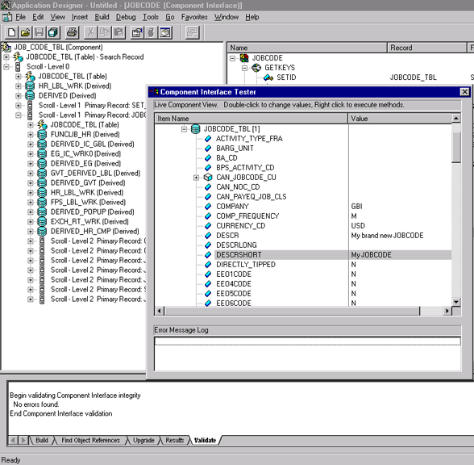
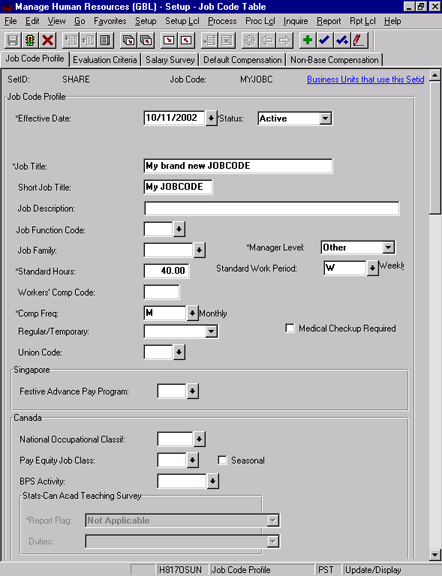

# How to Test Component Interfaces
Microsoft BizTalk Adapter for PeopleSoft Enterprise uses PeopleSoft metadata and component interfaces; therefore, it can handle new or modified component interfaces. The adapter makes no assumptions about component interfaces except that they are logical and valid. Therefore, each component interface must be tested before it is used as a source for the adapter.  
  
 If changes are made to the underlying application by the user or by a PeopleSoft upgrade, and the changes invalidate a component interface, the user must repair the invalid component interface before the adapter uses it.  
  
### To test a component interface  
  
1.  In Application Designer, on the **Tools** menu, click **Test Component Interface**.  
  
       
  
2.  In the **Component Interface Tester** dialog box, test the component interface by using one the following methods. After you finish making changes, right-click the top item in the pane.  
  
    > [!NOTE]
    >  If required, click the dialog box to bring it to the foreground.  
  
    -   To test the component interface using the Find method, click **Find**.  
  
         The **Component Interface Tester - Find Results** dialog box opens, displaying all the possible entries for the underlying component. If there are more than 300 entries, a message appears.  
  
         a. In the left pane of the **Find Results** dialog box, select a field.  
  
         b. To display the relevant data for that particular field, click **Get Selected**.  
  
         The following screen appears.  
  
           
  
         If the security settings allow, you can change the values in the individual fields.  
  
         The following dialog box opens.  
  
           
  
    -   To test the component interface using the `Get` method:  
  
         a. Enter the existing key(s).  
  
         b. Click **Get Existing**.  
  
         This returns the exposed properties for the key that you entered.  
  
         You can change values if **Update access** was specified.  
  
         Alternatively, you can test using the `Create` method.  
  
           
  
    -   To test the component interface using the `Create` method:  
  
         a. Enter all required key values.  
  
         b. Click **Create New**.  
  
         When you enter valid values in **Create keys**, a pane that displays the JOBCODE data opens after the Table name is expanded with default data in place.  
  
         You can change fields now.  
  
           
  
         Changes are validated against the component's underlying business logic.  
  
3.  To save your changes, click the **Save** icon.  
  
     The keys used to create the record can be used with the Get method for viewing data. The data that was added can be viewed in the PeopleSoft Component as shown in the following example.  
  
       
  
     **Effective Date** is one of the default values.  
  
## See Also  
 [Appendix A: Component Interface Methods](../core/appendix-a-component-interface-methods.md)   
 [Appendix C: Using Component Interfaces](../core/appendix-c-using-component-interfaces.md)