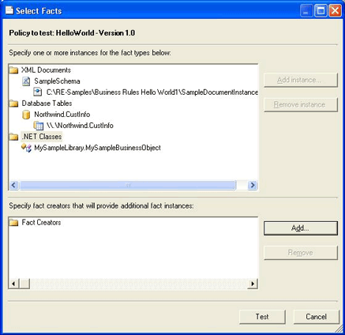

# How to Test Policies
To test a policy, you need facts on which the rules can be executed. You can add facts by specifying values in XML documents or database tables that you will point to in the policy tester, or you can use a fact creator to supply to the engine an array of .NET objects as facts. For more information, see [Creating a Fact Creator](../core/how-to-create-a-fact-creator.md).  
  
### To test a policy in the Business Rule Composer  
  
1.  In the Policy Explorer window, click the policy version that you want to test.  
  
2.  Click the **Test Policy** button (green arrow) on the menu bar.  
  
     The top pane displays the fact types that the policy rules reference.  
  
3.  To add a fact instance, click an **XML Document** or **Database Table** fact type, and then click **Add Instance**.  
  
4.  If you want to remove a fact instance, click the corresponding fact type, and then click **Remove Instance**.  
  
5.  If you want to add a fact creator that you have written, click **Add** in the fact creator pane.  
  
6.  Click **Test**.  
  
     The policy test trace output appears in the test output window.  
  
7.  Right-click in the output window to save, clear, select, or copy the output text.  
  
       
Selecting fact to test a policy