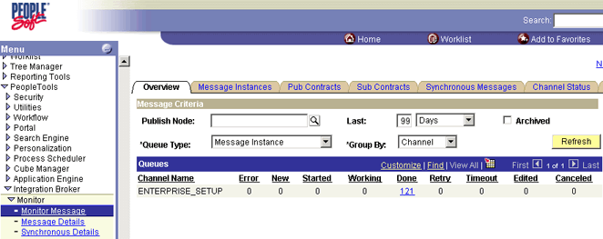
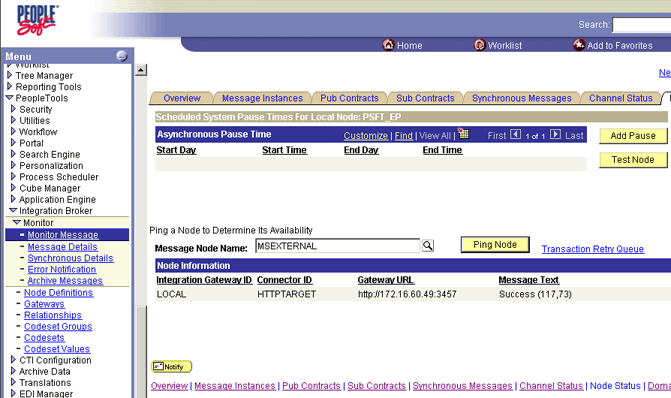

# How to Test the HTTP Node
Follow these steps to test the HTTP node.  
  
### To test the HTTP node  
  
1.  In PeopleSoft Enterprise, navigate to **PeopleTools**, **Integration Broker**, **Monitor**, **Monitor Message**.  
  
       
  
2.  Click the **Node Status** tab.  
  
3.  In the **Message Node Name** field, enter `MSEXTERNAL`, and then click the **Lookup** icon.  
  
4.  Under **Message Node Name**, select **MSEXTERNAL**.  
  
     A message appears and indicates that PeopleSoft is communicating through HTTP.  
  
       
  
     If you do not receive the message, verify the following:  
  
    1.  The IP addresses and ports match between the receive port and the node.  
  
    2.  BizTalk Server is running.  
  
## See Also  
 [Creating a PeopleSoft HTTP Host and Port](../core/creating-a-peoplesoft-http-host-and-port.md)
