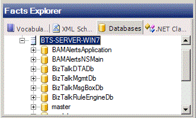

# How to Use a Database as a Data Source
You can specify a database as a data source. You can subsequently select a table or table column from the database, and drag it onto a vocabulary definition or rule to use as a fact.  
  
> [!NOTE]
>  You can choose to bind to the database row/table using either **DataConnection** or **TypedDataTable** by selecting "Data connection" or "Database table/row" from the **Database binding type** drop-down box in the Property Window for the **Databases** tab of Fact Explorer. **DataConnection** binding is used by default.  
  
### To specify a SQL database as a data source  
  
1.  In the Facts Explorer window, click the **Databases** tab.  
  
2.  Right-click the **Servers** node, and then click **Browse**.  
  
3.  In the drop-down list, select an available database server.  
  
4.  Select an authentication type. If you select SQL authentication, enter a logon name and password. When you have entered your authentication information, click **OK**.  
  
       
Browsing a database  
  
> [!NOTE]
>  SQL Server database views are not supported.
