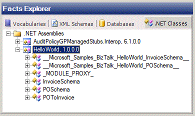

# How to Use a .NET Assembly as a Data Source
You can specify a .NET assembly as a data source. You can subsequently select a class or class member from the assembly, and drag it onto a vocabulary definition or rule.  
  
### To specify a .NET assembly as a data source  
  
1.  In the Facts Explorer window, click the **.NET Classes** tab.  
  
2.  Right-click the **Modules** node.  
  
3.  From the available assemblies, select a .NET assembly.  
  
    > [!NOTE]
    >  The assemblies have to be in the global assembly cache (GAC). The business rule composer loads a .NET assembly when you browse for the .NET assembly in the **Facts Explorer** window or in the **.NET Class or Class Member Definition** page of the **Vocabulary Definition** window.  If you update the assembly in the GAC, close the business rule composer and restart it to load the updated .NET assembly. The business rule composer does not refresh the assembly automatically.  
  
     