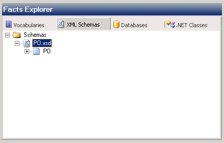

# How to Use an XML Schema as a Data Source
### To specify an XML schema as a data source  
  
1. In the Facts Explorer, click the **XML Schemas** tab.  
  
2. Right-click the **Schemas** folder, and then click **Browse**.  
  
3. In the **Schema Files** dialog box, select an XSD file, and then click **Open**.  
  
     
   Browsing an XML Schema