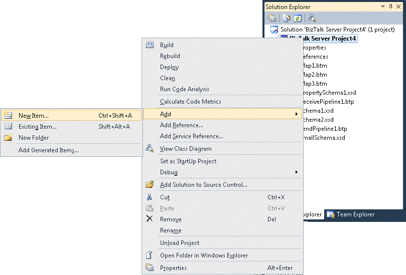

# How to Use BizTalk Flat File Schema Wizard
In previous releases of BizTalk Server, you had to manually add the annotations to XML Schema Definition language (XSD) schemas in the BizTalk Schema Editor to make these schemas understandable to Flat File Pipeline components, such as Flat File Disassembler and Flat File Assembler. You can still do this using the [!INCLUDE[btsBizTalkServerNoVersion](../includes/btsbiztalkservernoversion-md.md)] Schema Editor. To reduce the number of manual steps and time needed to create solutions, you use the BizTalk Flat File Schema Wizard, which provides the following functionalities:  
  
-   Uses real flat file instances as input.  
  
-   Includes a visual design surface for working with delimited and positional flat file schemas.  
  
-   Uses a re-entrant wizard-based process for adding elements to the schema and defining flat file related annotations interactively.  
  
-   Provides support for tag identifiers and character and hexadecimal delimiters.  
  
-   Automatically determines tag identifier offsets and child delimiting order.  
  
-   Provides preview capabilities for the file format.  
  
-   Enables you to select preferred sub-data within the interchange instance to use to define the flat file schemas.  
  
## How to Start the BizTalk Flat File Schema Wizard  
 You can start the wizard from either the Microsoft Visual Studio Solution Explorer or from the BizTalk Schema Editor.  
  
#### To start the wizard from Solution Explorer  
  
1. In Microsoft [!INCLUDE[btsVStudioNoVersion](../includes/btsvstudionoversion-md.md)], open the **Solution Explorer**.  
  
2. To add the new flat-file schema, right-click the BizTalk project, and select **Add**.  
  
3. Click **New Item.**  
  
      
  
4. In the **Add New Item** window, do the following:  
  
   1.  In the **Categories** section, select **Schema Files**.  
  
   2.  In the **Templates** section, select **Flat File Schema Wizard**.  
  
   3.  In the **Name** text box, type a name for the new schema.  
  
   4.  Click **Add**.  
  
        The BizTalk Flat File Schema Wizard opens.  
  
#### To start the Wizard from the Schema Editor  
  
1. In [!INCLUDE[btsVStudioNoVersion](../includes/btsvstudionoversion-md.md)], open the **Solution Explorer**.  
  
2. To add the new flat-file schema, right-click the BizTalk project, and select **Add**. Select **New Item** and click **New Item**.  
  
3. In the **Add New Item** window, do the following:  
  
   1.  In the **Categories** section, select **Schema Files**.  
  
   2.  In the **Templates** section, select **Flat File Schema**.  
  
   3.  In the **Name** text box, type a name for the new schema.  
  
   4.  Click **Add**.  
  
   5.  Right-click **Root** and select **Define Record from Flat File Instance**.  
  
        The BizTalk Flat File Schema Wizard now starts.  
  
> [!NOTE]
>  If you have a working schema opened in the Schema Editor, all you need to do is right-click the selected node and then select **Define Record from Flat File Instance**.  
  
> [!NOTE]
>  The **Define Record from Flat File Instance** option is enabled if the selected node is a record without child elements. If the selected node has child elements, the wizard deletes all current child elements and generates the new ones. The wizard prompts you to confirm before deleting the existing child elements.  
  
## Considerations for Using the Flat File Schema Wizard  
 This section describes issues you should consider when working with the BizTalk Flat File Schema Wizard.  
  
### Working with Multibyte Character Set (MBCS)  
 By default, the **Count positions in bytes** check box is unchecked on the Flat File Schema Information screen. The wizard counts the positions by characters; which mean that if you have MBCS characters in your positional flat file instance, the positions are not counted correctly. By selecting the **Count positions in bytes** check box, the wizard displays MBCS characters with an additional indication of their positional length. The character takes one position on the display and the remaining length is filled out with dot symbols, “•”. The number of dot symbols filled will be depending on the files that were saved in double byte character set (DBCS), Unicode or UTF-8 format.  
  
### Code Pages Supported in the Flat File Schema Wizard  
 The following is a list of supported code pages for the wizard:  
  
-   Arabic (1256)  
  
-   ASCII (20127)  
  
-   Baltic (1257)  
  
-   Big-Endian-UTF16 (1201)  
  
-   Central-European (1250)  
  
-   Cyrillic (1251)  
  
-   Greek (1253)  
  
-   Hebrew (1255)  
  
-   Japanese-Shift-JIS (932)  
  
-   Korean (949)  
  
-   Little-Endian-UTF16 (1200)  
  
-   Simplified-Chinese-GBK (936)  
  
-   Simplified-Chinese-GB18030 (54936)  
  
-   Thai (874)  
  
-   Traditional-Chinese-BIG5 (950)  
  
-   Turkish (1254)  
  
-   UTF-7 (65000)  
  
-   UTF-8 (65001)  
  
-   Vietnamese (1258)  
  
-   Western-European (1252)  
  
### Record Types in the Flat File Schema Wizard  
 Flat files cannot contain delimited records within positional records. Because the wizard is re-entrant based, the radio buttons that define the type of the **By delimiter symbol** and **By relative positions** are enabled or disabled based on the format of the parent records for the child which you define in the wizard. For example,  
  
-   If the wizard is run for a child of a delimited record, both radio buttons are selected.  
  
-   If the wizard is run for a child of a positional record, the **By delimiter symbol** radio button is cleared.  
  
### Delimiter Symbols in the Flat File Schema Wizard  
 The child delimiter property drop-down list contains with the following common delimiters:  
  
- {CR}{LF}  
  
- {CR}  
  
- {LF}  
  
- {TAB}  
  
- {SPACE}  
  
- {0x1A}  
  
- &#124;  
  
- ,  
  
- ;  
  
  The default value for this property is {CR}{LF}. The property is also an editable text box, so that you can specify the child delimiter as a sequence of characters or as hexadecimal values of the characters. An example of using characters for the child delimiter would be "a" or "street." Hexadecimal delimiters are specified using the following format:  
  
- {0xnnnn}. For example, {0x0D}{0x0A}, {0x09} or {0x20}.  
  
  An example of using sequence of hexadecimal values is {0x0D}{0x0A}, {0x09}{0x20}.  
  
  If you use the symbols \\, {, or } as the delimiter, you must place an additional backslash symbol in front of the delimiter symbol, otherwise you will receive an error message. For example,  
  
- \\\\, \\{, or \\}.  
  
### Relative Positions in the Flat File Schema Wizard  
  
#### Setting Position Markers  
 Use the left mouse button to click a position marker in the position selection box to set the new position marker line. The position marker is represented as a solid line. By default, a position marker line exists at the beginning of the record at position zero. To remove an existing position marker line, use the left mouse button to click  it.  
  
### Escape Characters in the Flat File Schema Wizard  
 An escape character is a single character that suppresses any special meaning of the character that follows it. For more information, see [Escape Characters](../core/escape-characters.md) topic under [Ways to Interpret Special Characters as Part of a Field Value](../core/ways-to-interpret-special-characters-as-part-of-a-field-value.md). You use the escape character property in the wizard to specify the escape character to use when parsing the flat file instance. The default is null, meaning that the default escape character defined at the schema level is used.  
  
 The escape character can be specified as a character or as a hexadecimal value. The hexadecimal value is specified using the following format:  
  
- {0xnnnn}. For example, {0x0D}{0x0A}, {0x09}, or {0x20}.  
  
  If you use the symbols \\, {, or } as the escape character, you must place an additional backslash symbol in front of the delimiter symbol, otherwise you will receive an error message For example,  
  
- \\\\, \\{, \\}.  
  
### Child Elements in the Flat File Schema Wizard  
 Each child element contains **Element Name**, **Element Type**, **Data Type** and **Content**. You use the **Element Name** text box to type a meaningful name for the node. The **Element Type** is a drop-down list with the following values:  
  
- **Field element**: Specifies that this node will be created in the schema as an element.  
  
- **Field attribute**: Specifies that this node will be created in the schema as an attribute.  
  
- **Record**: Specifies that a record without children will be created in the schema.  
  
- **Repeating record**: Specifies that a record without children will be created in the schema and its max occurrence is set to **Unbounded**.  
  
- **Ignore**: Nothing will be created in the schema for this node.  
  
  By default all elements are of type **Field element** and their data type is **string**.  
  
> [!NOTE]
>  A child element can be declared as a **Field attribute** only if there are no children before it that are declared as **Field elements**, **Record** or **Repeating record**.  
  
> [!NOTE]
>  You will see an exclamation mark in front of the **child nodes** in the following instances:  
  
-   The **Field attribute** is defined after **Field element**, **Record,** or **Repeating record**.  
  
-   The child element does not have a name.  
  
-   The child element has a duplicate name.  
  
-   The selected data type for the child element is not suitable for the content.  
  
## See Also  
 [BizTalk Flat File Schema Wizard Walkthrough](../core/biztalk-flat-file-schema-wizard-walkthrough.md)