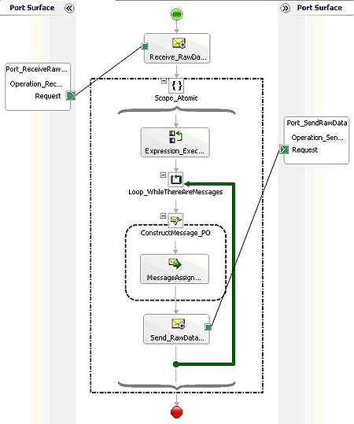
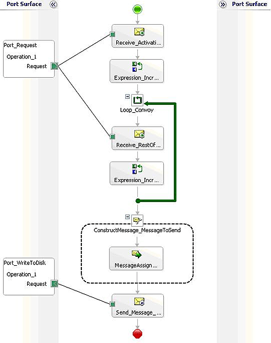

# How to Use Expressions to Execute Pipelines
[!INCLUDE[btsBizTalkServerNoVersion](../includes/btsbiztalkservernoversion-md.md)] has the ability to synchronously call a pipeline from within an Orchestration. This enables orchestrations to leverage the message processing encapsulated within a pipeline (either send or receive) against a body of data without having to send that data through the messaging infrastructure.  
  
 You can use this feature to enable an orchestration to call a send pipeline in order to aggregate several messages into a single outgoing interchange. Conversely, an orchestration could call a receive pipeline to decode and disassemble an interchange obtained outside of the messaging infrastructure, without incurring the processing costs of going through the message box.  
  
## Details  
 Orchestrations use methods in the **XLANGPipelineManager** class (in the **Microsoft.XLANGs.Pipeline** namespace) to call send or receive pipelines.  A Receive pipeline consumes either a single message or an interchange and yields zero or more messages, just as when the pipeline executes in the context of receiving a message within BizTalk messaging. A Send pipeline consumes one or more messages and yields a single message or interchange, again, just as when the pipeline executes in the context of sending a message within BizTalk messaging.  
  
## Calling a Receive Pipeline  
 In order to call a receive pipeline from within an orchestration, the application calls the **ExecuteReceivePipeline()** method of the **XLANGPipelineManager** class.  This method consumes a single interchange and returns a collection of zero or more messages (contained in an instance of the **ReceivePipelineOutputMessages** class). The syntax of this method is detailed in the .NET class library reference for the **XLANGPipelineManager** class.  
  
 The API for executing a receive pipeline from within an orchestration is:  
  
 `// Execute receive pipeline`  
  
 `static public ReceivePipelineOutputMessages ExecuteReceivePipeline(System.Type receivePipelineType, XLANGMessage msg);`  
  
 A call to a receive pipeline would typically be done in an **Expression** shape within the orchestration.  
  
 In order to call a receive pipeline from within an orchestration, the developer must reference the pipeline assembly in the orchestration project. Following is an example of an orchestration that calls a receive pipeline:  
  
   
  
 For a more detailed example, see the SDK sample [Composed Message Processor (BizTalk Server Sample)](../core/composed-message-processor-biztalk-server-sample.md).  
  
> [!NOTE]
>  A variable of type **ReceivePipelineOutputMessages** can be declared only within an atomic scope in an orchestration.  This is because variables of this type are not serializable and thus would not survive persistence of the orchestration, and orchestrations are never persisted while executing within an atomic scope.  This means that a receive pipeline can be executed only within an atomic scope.  
  
> [!NOTE]
>  When calling **PassThruReceive** pipeline or custom pipeline component from within an orchestration, you must declare the variable type for incoming message as System.Xml.XmlDocument despite of the incoming message type is XML or not. Therefore, you may encounter exception if you try to operate on it if the incoming message is a non-XML message such as a flat file format message. This is because of that orchestration engine intends to use System.Xml.XmlDocument for any type of incoming message in the scenario described above.  
  
## Calling a Send Pipeline  
 To call a send pipeline from within an orchestration, the application calls the **ExecuteSendPipeline()** method of the **XLANGPipelineManager** class. This method consumes a collection of one or more messages (contained in an instance of the **SendPipelineInputMessages** class) and returns a single interchange. The syntax of this method is detailed in the .NET class library reference for the **XLANGPipelineManager** class.  Because execution of a send pipeline yields a new interchange, the call to **ExecuteSendPipeline()** method must be made within a message assignment shape, as such:  
  
 The API for executing a send pipeline from within an orchestration is:  
  
 `// Execute a send pipeline`  
  
 `static public ExecuteSendPipeline(System.Type sendPipelineType, SendPipelineInputMessages inputMsgs, XLANGMessage msg);`  
  
 A call to a send pipeline must be done in a **Message Assignment** shape within the orchestration.  
  
 In order to call a send pipeline from within an orchestration, the developer must reference the pipeline assembly in the orchestration project.  An example of an orchestration that calls a send pipeline:  
  
   
  
> [!NOTE]
>  When calling the default XMLTransmit pipeline, you must set the message context property XMLNORM.EnvelopeSpecName to the fully qualified name of the Envelope schema. For example:  
>   
>  `MyMessage(XMLNORM.EnvelopeSpecName) = "PipelineSchemas.POEnv, PipelineSchemas, Version=1.0.0.0, Culture=nuetral, PublicKeyToken=12e5cc95621c33e8";`  
  
 For a more detailed example, see the SDK sample [Aggregator (BizTalk Server Sample)](../core/aggregator-biztalk-server-sample.md).  
  
## Pipeline Execution - Behavioral Differences  
 The execution of a send or receive pipeline when called by an orchestration is predominantly the same as when the same pipeline executes within the messaging infrastructure (i.e. at receive location or send port).  However, there are certain behavioral differences that are noted below.  
  
### Differences Within Pipeline Stages  
 The execution of the stages within a send or receive pipeline that is called from within an orchestration is nearly identical to the execution of those stages when the pipeline is called from the BizTalk messaging infrastructure, with the exceptions noted by stage below.  
  
-   Assembler/Disassembler:  The assembler and disassembler stages will not process **Tracking Profile** data.  
  
-   Encoder/Decoder:  The MIME encoder digitally signs messages using the certificate configured at the host with which the host is associated.  The SMIME encoder encrypts messages using the certificate on the context of the message passed into the pipeline.  
  
### Schema Resolution  
 There are two schema lookup algorithms that are supported when executing a pipeline from an orchestration:  
  
- Resolution by type  
  
- Resolution by name  
  
  In cases where duplicate schemas are deployed, the algorithm's logic for selecting the appropriate schema is identical to that used when executing in the context of the messaging infrastructure.  
  
### Transactional Pipelines  
 Pipelines whose stages call transactional components will not have a transactional context available.  Any call to **IPipelineContext.GetTransaction()** will throw **NotSupportedException**.  This does not preclude execution of such a pipeline from an orchestration, but it does mean that the pipeline will have to detect and handle this situation.  
  
### Message Destination  
 Controlling message destination by pipeline components is not supported in this context.  Setting the context properties **MessageDestination** or **SuspendOnRoutingFailure** will cause an **XLANGPipelineManagerException** to be thrown.  
  
### Pipeline Component Types  
 Pipeline components must be based on the following in order to be called from within an orchestration:  
  
-   .NET Framework v1.1  
  
-   .NET Framework v2.0  
  
-   .NET Framework v3.0  
  
-   .NET Framework v3.5  
  
-   .NET Framework v4.0  
  
-   .NET Framework v2.0  
  
-   COM  
  
## Restrictions  
 The following types of pipelines **cannot** be executed from within an orchestration:  
  
- Transactional pipelines  
  
- Recoverable pipelines  
  
- Pipelines which call the BAM interceptor API (a **NotSupportedException** will be thrown).  
  
- The same pipeline instance cannot be executed in different branches of the parallel shape unless it is placed in a synchronized scope in every branch.  
  
- Existing pipelines (assemblies) that were built against the [!INCLUDE[btsBizTalkServer2006](../includes/btsbiztalkserver2006-md.md)] SDK.  
  
## Failure Modes and Effects  
 Any failure in pipeline execution which would have resulted in a suspended message were this pipeline to be called from within the BizTalk Server Messaging Infrastructure will instead result in an exception being thrown.  The exception thrown is of type **Microsoft.XLANGs.Pipeline.XLANGPipelineManagerException**.  This thrown exception can be handled in a catch block within the calling orchestration.  If the orchestration does not catch the thrown exception, the XLANGs engine reports an error the text of which includes the exception information in the thrown exception.  
  
 The exception performs formatting of the error messages generated by the pipeline components.  
  
 The **Message** property of the **XLANGPipelineManagerException** class contains details of the pipeline's execution error. This detail is in the following format:  
  
- There was a failure executing pipeline \<pipeline type\>.  Error details \<formatted error message\>.  
  
  In this message, \<pipeline type\> is the name of the pipeline class and \<formatted error message\> is a description of the specific failure that occurred during pipeline execution.  
  
  For example, if an orchestration calls a receive pipeline and that pipeline's execution fails because none of the pipeline's components recognizes the message, the values of the **XLANGPipelineManagerException**'s properties would be:  
  
|XLANGPipelineManagerException property|Value|  
|--------------------------------------------|-----------|  
|Message|There was a failure executing the receive pipeline "MyPipelines.ReceivePipeline". Error details: "No Disassemble stage components can recognize the data.|  
|Component|String.Empty|  
  
 As another example, if an orchestration calls a send pipeline and that pipeline's execution fails because there is a validation failure, the text in the **Message** property of **XLANGPipelineManagerException** would be:  
  
|XLANGPipelineManagerException property|Value|  
|--------------------------------------------|-----------|  
|Message|There was a failure executing the send pipeline "MyPipelines.SendPipeline".  Error details:  "Failed to validate the document: "The \<element name\> element is invalid - The value \<element value\> is invalid according to its datatype 'String' - The Pattern constraint failed.""|  
|Component|“Microsoft.BizTalk.Component.XmlValidator”|