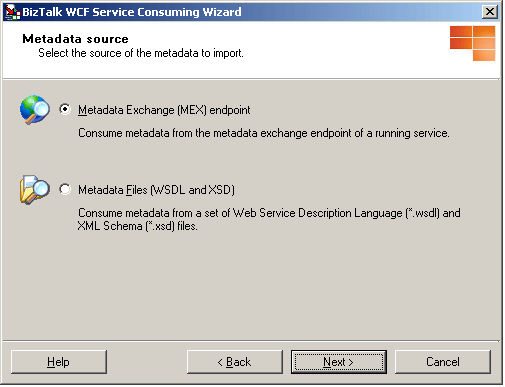
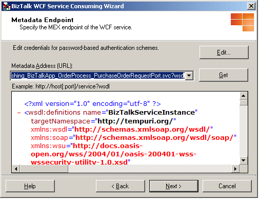
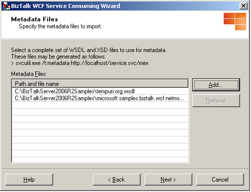

# How to Use the BizTalk WCF Service Consuming Wizard to Consume a WCF Service
The BizTalk Adapter Framework provides a way to add adapter schemas and BizTalk types to BizTalk projects. The BizTalk WCF Service Consuming Wizard enables you to add WCF send adapters to a BizTalk project. For the WCF send adapters, you must select an existing metadata exchange (MEX) endpoint for send ports. Then you need to enter the information used to generate the schemas and types. When the wizard completes, the schemas and types necessary to consume WCF services are added to the BizTalk project.  
  
### To add the schemas and types for WCF send adapters to your project  
  
1. In your Microsoft [!INCLUDE[btsVStudioNoVersion](../includes/btsvstudionoversion-md.md)] BizTalk project, in Solution Explorer, right-click your project, click **Add**, and then click **Add Generated Items**.  
  
2. In the **Add Generated Items - \<**<em>Project name</em>**\>** dialog box, in the **Templates** section, select **Consume WCF Service**, and then click **Add**.  
  
3. On the **Welcome to the BizTalk WCF Service Consuming Wizard** page, click **Next**.  
  
4. On the **Metadata source** page, select the source of the metadata to import, and then click **Next**.  
  
      
  
    To download metadata documents from the metadata exchange endpoint of a running service, select the **Metadata Exchange (MEX) endpoint** option. This allows us to create a send port that acts a client to the WCF service. To use this option, the service endpoint must publish service metadata for retrieval using an HTTP/GET or HTTPS/GET request. The service endpoint must also allow access to the metadata with anonymous user credentials or user credentials in the form of a user name and password with the basic authentication scheme.  
  
   > [!NOTE]
   >  With basic authentication scheme, the credentials are sent as plaintext and could be intercepted easily. The scheme also provides no protection for the information passed back from the service. You must use Secure Sockets Layer (SSL) to encrypt your data.  
  
    For any other metadata documents to import, select the **Metadata Files (WSDL and XSD)** option to import metadata from a file system.  
  
   > [!NOTE]
   >  Not all services must publish metadata. Leaving metadata publishing disabled reduces the attack surface for your service and lowers the risk of unintentional information disclosure.  
  
5. If you selected the **Metadata Exchange (MEX) endpoint** option on the **Metadata source** page, the **Metadata Endpoint** page appears. On the **Metadata Endpoint** page, specify the URL to the running service that provides metadata for download through WS-Metadata Exchange or Http-Get. To get the metadata document from the URL, click **Get**. If the running service requires a user credential with the basic authentication scheme, click **Edit** to open **the BizTalk WCF Service Consuming Wizard** dialog box in which you can supply user name and password to use when accessing running the service.  
  
      
  
   > [!NOTE]
   >  To download the metadata for WCF services published through HTTP or HTTPS, you cannot use the MEX endpoint such as http://localhost:8087/CalculatorService/mex for the **Metadata Address** text box. For the WCF services, you must use the WSDL metadata to download the metadata as follows: http://localhost:8087/CalculatorService or http://localhost:8087/CalculatorService?wsdl  
  
6. If you selected the **Metadata Files (WSDL and XSD)** option on the **Metadata source** page, the **Metadata Endpoint** page appears. On the **Metadata Endpoint** page, specify metadata files to import. Click **Add** to add the metadata files to import to the **Metadata Files** view. This opens the **Add metadata files** dialog box in which you can search disk locations for metadata files.  
  
    In the **Add metadata files** dialog box, select a complete set of WSDL and XSD files to use for metadata. You can generate these metadata files by typing the following command at the command prompt:  
  
    **svcutil.exe /t:metadata http://localhost/service.svc/mex**  
  
    Click **Remove** to remove the metadata files selected in the **Metadata Files** view.  
  
      
  
   > [!NOTE]
   >  SvcUtil.exe is included in the Microsoft Windows Software Development Kit (SDK) of Windows Vista and .NET Framework Runtime Components.  
  
   > [!NOTE]
   >  Service metadata can be tampered with or spoofed when retrieved in an insecure manner. Tampered metadata could redirect your client to a malicious service, contain compromised security settings, or contain malicious XML structures. Metadata documents can be very large and are frequently saved to the file system. You must make sure that metadata files have not been tampered with.  
  
7. On the **Import WCF Service Metadata Summary** page, review your settings. You can click **Back** to make any changes. Then click **Import** to create the BizTalk artifacts and types to be used for consuming the WCF service.  
  
8. On the **Completing the BizTalk WCF Service Consuming Wizard** page, click **Finish**. If you want to run this wizard again, select the **Run this wizard again** option, and then click **Finish**.  
  
    The BizTalk WCF Service Consuming Wizard creates in your BizTalk project the BizTalk schemas and types necessary to consume WCF services. The BizTalk types such as port types and multipart message types are created in an orchestration. We recommend that you do not modify the orchestration that the wizard creates. Instead, you can add new orchestrations in the BizTalk project for your purposes. The BizTalk WCF Service Consuming Wizard also creates two binding files, **BizTalkServiceInstance.BindingInfo.xml** and **BizTalkServiceInstance_Custom.BindingInfo.xml**. **BizTalkServiceInstance.BindingInfo.xml** is a BizTalk binding file that can be imported by the development command-line tool or wizard to configure the send ports with the standard binding WCF adapters—for example, the WCF-NetMsmq and WCF-WSHttp adapters. **BizTalkServiceInstance.BindingInfo.xml** is a BizTalk binding file that can be imported by the development command-line tool or wizard to configure the send ports with the WCF-Custom adapter.  
  
    When you import the generated binding file, it populates the **WCF.Action** property in the action mapping format. To see how this property is configured, look at the **Action** text box on the **General** tab in the WCF send port transport properties dialog box in the BizTalk Administration console.  
  
    You can specify the **WCF.Action** property in two different ways: the single action format and the action mapping format. If you set this property in the single action format- for example, http://contoso.com/Svc/Op1 - the **SOAPAction** header for outgoing messages is always set to the value specified in this property. If you set this property in the action mapping format, the outgoing **SOAPAction** header is determined by the **BTS.Operation** context property. For example, if this property is set to the following XML format and the **BTS.Operation** property is set to **Op1**, the WCF send adapter uses http://contoso.com/Svc/Op1 for the outgoing **SOAPAction** header.  
  
    `<BtsActionMapping>`  
  
    `<Operation Name="Op1" Action="http://contoso.com/Svc/Op1" />`  
  
    `<Operation Name="Op2" Action="http://contoso.com/Svc/Op2" />`  
  
    `</BtsActionMapping>`  
  
    If outgoing messages comes from an orchestration port, orchestration instances dynamically set the **BTS.Operation** property with the operation name of the port. If outgoing messages are routed with content-based routing, you can set the **BTS.Operation** property in pipeline components. The ports generated by the BizTalk WCF Consuming Wizard have operations with names that match the **Name** attributes in the **<BtsActionMapping>** element. You do not have to explicitly set the **BTS.Operation** property in orchestrations when you send messages through ports that were generated by the wizard.  
  
## See Also  
 [How to Use the BizTalk WCF Service Publishing Wizard to Publish Orchestrations as WCF Services](../core/publish-orchestrations-as-wcf-services--biztalk-wcf-service-publishing-wizard.md)   
 [How to Use the BizTalk WCF Service Publishing Wizard to Publish Schemas as WCF Services](../core/publish-schemas-as-wcf-services--use-the-biztalk-wcf-service-publishing-wizard.md)