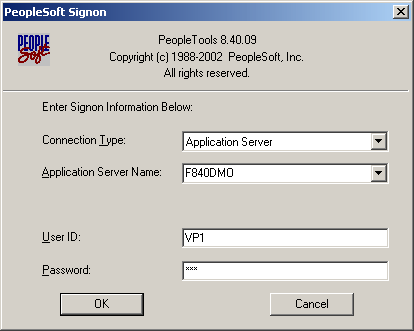
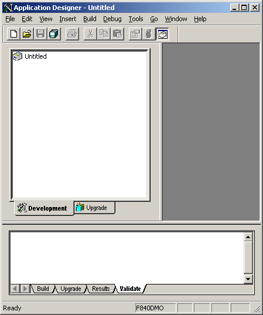
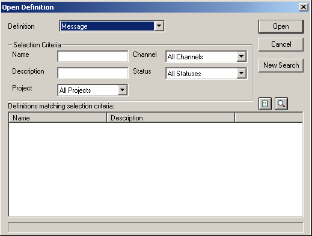
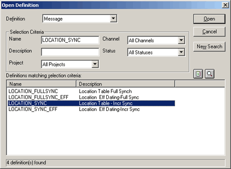
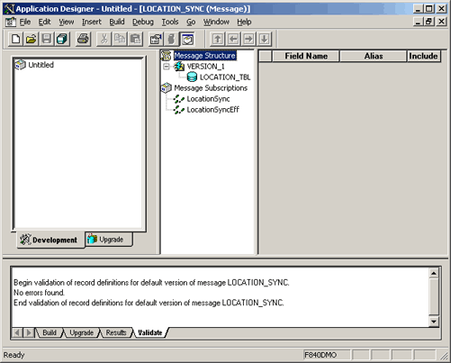
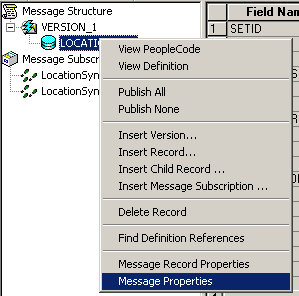
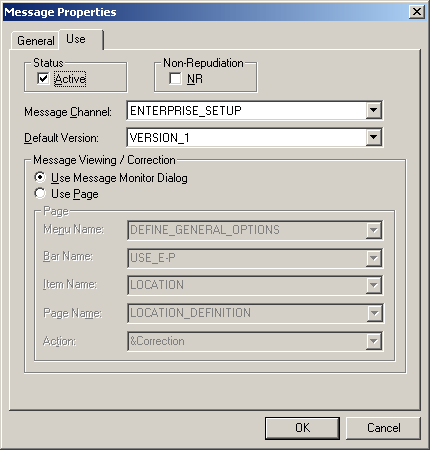

# How to Verify Activity Status of a Message
You use the PeopleSoft Integration Broker to create a PeopleSoft HTTP Host and Port where PeopleSoft sends events. You make sure that the message is active and routed by following these steps.  
  
### To verify that a Message is active and routed correctly  
  
1. Click **Start**, point to **Programs**, point to **PeopleSoft Application Name**, and then select **Application Designer**.  
  
2. On the **PeopleSoft Sign-on** screen, enter the **User ID** and **Password**, and then click **OK**.  
  
      
  
      
  
3. In the Application Designer, on the **File** menu, point to **Open**, and then select **Message**.  
  
      
  
4. In the **Open Definition** screen, in the **Name** field, enter `LOCATION_SYNC`, and then click **Open**.  
  
      
  
5. In the **Definitions matching selection criteria** section, double-click the **LOCATION_SYNC** message to view the properties.  
  
      
  
6. In the Application Designer, right-click **LOCATION_TBL**, and select **Message Properties**.  
  
      
  
7. On the **Message Properties** screen, click the **Use** tab.  
  
    Verify the following, and then click **OK**.  
  
   1. **Message:** Active  
  
   2. **Message Channel:** ENTERPRISE_SETUP  
  
   3. **Default Version:** VERSION_1  
  
        
  
8. Exit the Application Designer.  
  
    This makes sure that the Message is in an active state, uses VERSION_1, and flows through the ENTERPRISE_SETUP channel in PeopleSoft.  
  
9. Configure the Integration.Gateway.properties file to communicate with the PeopleSoft application.  
  
     Verify that the following properties are set:  
  
    -   **ig.isc.serverurl:** //server:9000  
  
    -   **ig.isc.userid:** ID for PS  
  
    -   **ig.isc.password:** Password for PS  
  
    -   **ig.isc.toolsrel:** Specific Release  
  
## See Also  
 [Creating a PeopleSoft HTTP Host and Port](../core/creating-a-peoplesoft-http-host-and-port.md)