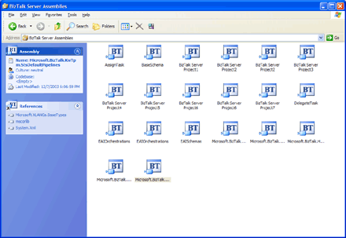
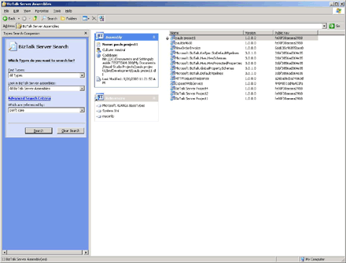

# How to View Assemblies and Types on the Local Server
You can use the BizTalk Assembly Viewer to examine all BizTalk assemblies and types installed on the local server.  
  
### To view all BizTalk Server assemblies installed in the GAC  
  
-   To open the BizTalk Assembly Viewer, double-click **My Computer**, and then double-click **BizTalk Server Assemblies**.  
  
     All BizTalk assemblies installed in the global assembly cache (GAC) on the computer appear.  
  
       
Assembly Viewer open page  
  
### To view types, attributes, and references for a BizTalk assembly  
  
1.  To open the BizTalk Assembly Viewer, double-click **My Computer**, and then double-click **BizTalk Server Assemblies**.  
  
2.  Double click the appropriate assembly.  
  
     The BizTalk assembly types appear in the right pane. The attributes and types appear in the left pane.  
  
     You can also navigate to the installed location of the assembly by clicking the **Codebase** link in the upper left section of the task pane. (You cannot view this link when Windows Explorer is in Folder view because the task pane is replaced by the folder list.)  
  
### To view the contents of a type in a BizTalk assembly  
  
1.  To open the BizTalk Assembly Viewer, double-click **My Computer**, and then double-click **BizTalk Server Assemblies**.  
  
2.  Double click the appropriate assembly.  
  
3.  In the right pane, double-click the appropriate type.  
  
     The **Type Content Viewer** window opens and the XML definition appears.  
  
### To add a BizTalk assembly in the GAC  
  
1.  To open the BizTalk Assembly Viewer, double-click **My Computer**, and then double-click **BizTalk Server Assemblies**.  
  
2.  Use Windows Explorer to navigate to the assembly that you want to add in the GAC.  
  
3.  Drag the assembly and drop it into the BizTalk Assembly Viewer.  
  
     The BizTalk Assembly Viewer accepts only BizTalk Server assemblies. If you drop a non-BizTalk assembly in the viewer, it is ignored.  
  
### To remove a BizTalk assembly from the GAC  
  
1.  To open the BizTalk Assembly Viewer, double-click **My Computer**, and then double-click **BizTalk Server Assemblies**.  
  
2.  Right-click the assembly you want to remove from the GAC and click **Delete**.  
  
### To search for a type in all BizTalk assemblies  
  
1.  To open the BizTalk Assembly Viewer, double-click **My Computer**, and then double-click **BizTalk Server Assemblies**.  
  
2.  From the menu bar, click the **Biz Talk Server Search** icon.  
  
3.  In the Search window, specify the type in the **Find Types** drop-down list.  
  
4.  In the **Look in BizTalk Server assemblies** drop-down list, select the assemblies to be searched.  
  
5.  To narrow your search to include only types that are referenced by a specified type, do the following:  
  
    1.  Click the **Advanced Search Criteria** link.  
  
    2.  In the **Which are referenced by** drop-down list, select the type.  
  
    3.  Click **Search**.  
  
         The specified types appear in the search results.  
  
           
BizTalk Assembly Types  
  
## See Also  
 [Viewing Assemblies with the BizTalk Assembly Viewer](../core/viewing-assemblies-with-the-biztalk-assembly-viewer.md)
