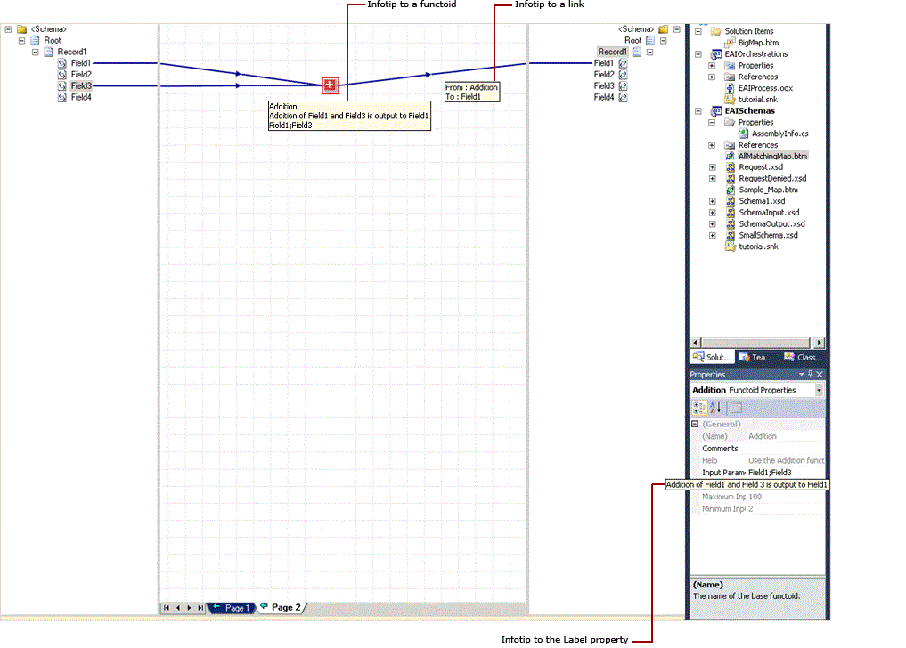
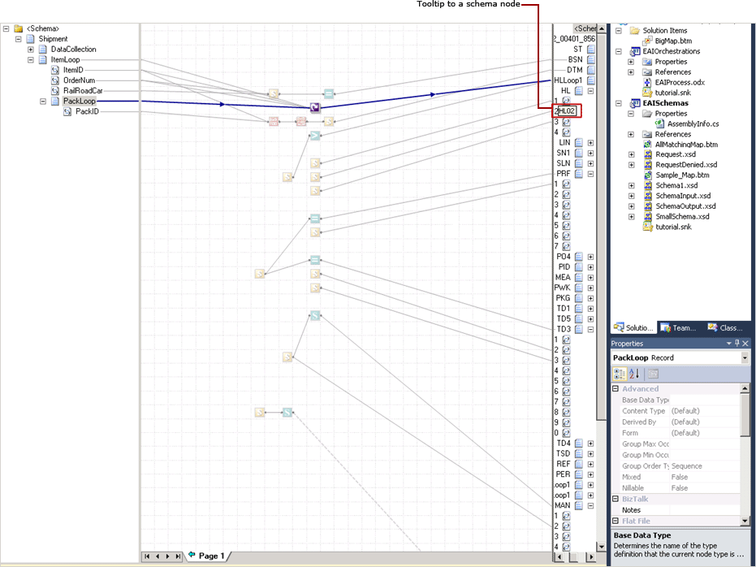

# How to View Infotip and Tooltip
When you move the cursor over a map item without clicking it, a screen tip appears with useful information about that item.  
  
 The BizTalk Mapper uses two types of screen tips – infotip and tooltip.  
  
- **Infotips** are displayed for functoids or links. When you configure labels or comments for functoids or links, you see them as infotip on the grid page. Also, when the text value for properties exceeds the display of the **Properties Grid**, the infotip is displayed.  
  
- **Tooltips** are displayed for those schema nodes that are hidden partially/completely from the current alignment in the grid view.  
  
  For link labels, only the first 256 characters are retained, and the tooltip displays the complete label. For functoids, the label can contain a maximum of 256 characters and comments have a limit of 1024 characters. Text of comment gets truncated accordingly to display only first 256 characters of comment.  
  
## Prerequisites  
 To view the tooltips, ensure BizTalk Mapper is running.  
  
## To view the infotip  
 When you move the mouse on a functoid, the infotip displays information about the functoid name, the functoid label, the functoid comment, and the input parameters (if existing). For a **Scripting** functoid, the infotip displays the first few lines of code.  
  
 The infotip to a link displays the following information:  
  
- Link label, if set.  
  
- **From: source connection**. If the source connection is a schema element, it shows the element name. If the source connection is a functoid, it shows the functoid name.  
  
- **To: destination connection**. If the destination connection is a schema element, it shows the element name. If the destination connection is a functoid, it shows the functoid name.  
  
  If the fields in the **Properties Grid** have text that exceeds the display, move the mouse on the field. The infotip will show the full text.  
  
  The following figure illustrates infotips to a functoid, link, and the **Properties Grid**.  
  
    
  
## To view the tooltip  
 When your source and/or destination schemas are big, your map can span vertically; hence the schema nodes may be partially visible. In such a scenario, you can see tooltips when you move the mouse on those source nodes.  
  
 The following figure shows a tooltip to a partially hidden target schema node.  
  
   
  
## See Also  
 [Using BizTalk Mapper](../core/using-biztalk-mapper.md)