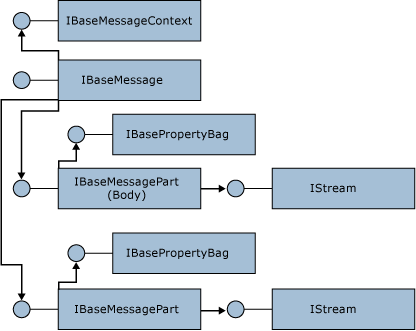

# IBaseMessage Interface
When a receive adapter accepts an incoming data packet through its protocol, it uses the **IBaseMessage** interface to create a message to pass to the Messaging Engine. All messages are represented by using this interface.  
  
 A message has one or more message parts represented by the **IBaseMessagePart** interface. Each message part has a reference to its data through an **IStream** interface pointer. The context of a message is represented by its **IBaseMessageContext** interface. The following figure illustrates the BizTalk message object model.  
  
   
  
 The message context is a dictionary that is keyed on a combination of the property name and the property namespace. This prevents collisions between similarly named properties from different sources, for example, [!INCLUDE[btsBizTalkServerNoVersion](../includes/btsbiztalkservernoversion-md.md)] system properties and custom adapter properties. The values for these properties are of the .NET type **object**, but in fact these properties are VARIANTs.  
  
 Each part has a part context that is also a dictionary but without the notion of a namespace. The value of a part context is metadata referring to the data for that part. An example of this is the **Charset** property that specifies the character set used for encoding the message.  
  
 Properties may be written to and read from the message context. They may also be promoted to be used for message routing. Being promoted means they are written as a part of metadata that flows with the message. A promoted property allows its value to be used in the creation of filter expressions on send ports and orchestrations. Downstream components and user code in orchestrations may read promoted properties and also write new values to them.  
  
 After a promoted property has been matched to an existing subscription and used to route a message, the property is demoted to prevent cyclic subscription matches. A demoted property remains on the message context as metadata but loses its promoted status.  
  
 **Implementation Tip:** Message context properties are loaded into memory at run time. Very large pieces of data should not be written to the message context because this could potentially break the [!INCLUDE[btsBizTalkServerNoVersion](../includes/btsbiztalkservernoversion-md.md)] large message support. Objects may be serialized into the message context providing they implement the **IPersistStream** interface. Also, promoted properties are limited to 255 characters.  
  
 The message factory should always be used to create new messages.  The following code fragment illustrates how to create a new BizTalk message from the data stream received by the adapter.  
  
```  
using Microsoft.BizTalk.Message.Interop;  
  
IBaseMessage CreateMessage( Stream s, IBaseMessageFactory msgFactory )  
{  
IBaseMessage msg = null;  
IBaseMessagePart part = msgFactory.CreateMessagePart();  
part.Data = s;  
msg = msgFactory.CreateMessage();  
msg.AddPart("body", part, true);  
return msg;  
}  
```