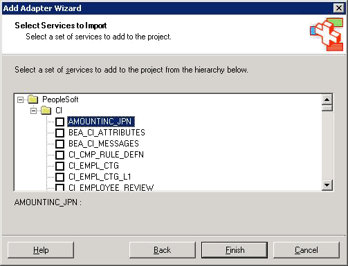

# Importing PeopleSoft Schemas into BizTalk Server Projects
When you have created the PeopleSoft Enterprise system, you can browse the server and import schemas into a BizTalk Server project.  
  
## Browsing a PeopleSoft Server System  
 Use the Adapter Wizard to browse a PeopleSoft server.  
  
#### To browse a PeopleSoft server system  
  
1.  Right-click a BizTalk Server project, and select one of the following options.  
  
    -   If you already have a schema generated for your object, select **Add**, click **Add Schema,** and then select the existing schema to add to your orchestration,.  
  
    -   If you do not have a schema generated for your object, select **Add**, then click **Add Generated Items**, and then select the adapter. This is the same name entered in the **AdapterProperties** dialog box. For more information, see "Adapter Properties Dialog Box" in the main BizTalk help.  
  
2.  Click Next.  
  
     The PeopleSoft Enterprise system appears in the browser.  
  
       
  
### Component Interfaces  
 In the **Component Interfaces** (CI) folder, you can view all the available component interfaces in the system. A component interface declares the set of methods and properties that it supports. A component interface does not implement behavior or properties. Microsoft BizTalk Adapter for PeopleSoft Enterprise exposes standard methods, for example, CreateEx, DeleteOnly, Find, Get, and UpdateEx. For a description of these methods, see [Appendix A: Component Interface Methods](../core/appendix-a-component-interface-methods.md).  
  
## Generating Schemas  
 Follow these steps to generate schemas.  
  
#### To generate the schemas  
  
-   Select the item for which you want to import schemas: a **Message**, **Query**, or **Component Interface**.  
  
     BizTalk Server generates the schemas for the selected item and imports them into a BizTalk Server project.  
  
    > [!NOTE]
    >  If the server object definitions change, you must regenerate the schema to update the data it contains.  
  
## See Also  
 [Creating PeopleSoft Send Handlers](../core/creating-peoplesoft-send-handlers.md)