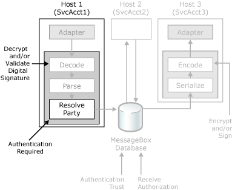

# Inbound Message Authentication
BizTalk Server can authenticate the sender of a message (either by using the certificate information or Windows integrated security) in order to validate the identity of the sender of the message. The following figure shows the security features in [!INCLUDE[btsBizTalkServerNoVersion](../includes/btsbiztalkservernoversion-md.md)] that you can use to authenticate inbound messages.  
  
   
Security features BizTalk Server uses to authenticate inbound messages.  
  
 When BizTalk Server receives an encrypted and signed message, it takes the following steps to ensure that the sending party is recognized.  
  
1.  When a message arrives at a BizTalk Server receive location, the receive handler attempts to obtain the sender's Windows security ID (SSID) from the sending process. The receive location passes the SSID downstream to support cases where the listener has already authenticated a signed message. If client-side certificate information can be obtained (for example by the BizTalk Message Queuing or HTTP adapter), the BizTalk Server receive location can obtain that certificate information and pass it along for party resolution later on in the receive pipeline. If the receive handler cannot obtain the SSID, this field is left blank.  
  
     The receive handler sends the message to the receive pipeline, where the message is decrypted, the digital signature is verified, and the party resolution takes place if the pipeline has a party resolution component. If the sender used a signing certificate on the incoming message, then the MIME/SMIME decoder component overwrites any certificate information obtained from the adapter.  
  
2.  If the sender encrypted the message, the MIME/SMIME decoder retrieves the decryption certificate from the personal certificate store for the host instance service account and uses the private key to decrypt the message.  
  
     If the sender signed the message, the MIME/SMIME decoder authenticates the digital signature by verifying the payload hash for signs of tampering, and then retrieving the certificate from the certificate store to verify the signature. If the public key of the signer is on the message itself, the MIME/SMIME decoder does not retrieve the certificate from the certificate store, but uses the public key that came with the message.  
  
3.  Usually, the final processing step in the pipeline is party resolution. Using BizTalk Explorer or BizTalk Server Administration console, you can create parties, map the party to a signing certificate, or create party aliases. All parties you define in BizTalk Explorer have a unique party identifier (PID). BizTalk Server obtains the PID and places it in the message context. BizTalk obtains the PID by one of the following methods:  
  
    1.  If the sender signed the message or if the receive handler was able to obtain a client-side certificate, and you selected the option to resolve the party by using the certificate, then BizTalk uses the corresponding signature or client-side certificate to lookup the PID. You must configure the party with the certificate as a property before you start receiving its messages. For more information how to configure the party, see [Using Certificates for Party Resolution](../core/using-certificates-for-party-resolution.md).  
  
    2.  If the sender did not use a signing certificate on the message, and you have selected the option to resolve the party by using the Sender's Security ID (SSID), the party resolution component uses the SSID to look up the PID. You must configure the party to use the SSID as an alias before you start receiving its messages. For more information about the party resolution component, see [Party Resolution Pipeline Component](../core/party-resolution-pipeline-component.md).  
  
        > [!NOTE]
        >  BizTalk Server uses the account name rather than the actual Windows SID when defining aliases for parties.  
  
    3.  If the party cannot be resolved, the pipeline sets the PID to Guest.  
  
4.  If you marked the receive port as Authentication Required, and BizTalk Server obtained a valid PID and resolved it to a known party, the message is then queued to the MessageBox database. If the SSID is blank or the PID is a guest ID, BizTalk Server either discards the message or sends it to the suspended queue (depending on your configuration of the Authentication Required property). You can use the Authentication Required property as a way of minimizing the negative effect of receiving a large quantity of messages from an unknown party. For more information about the authentication options for receive ports, see [How to Configure Authentication Options for a Receive Port](../core/how-to-configure-authentication-options-for-a-receive-port.md).  
  
## See Also  
 [Authentication of Messages Between Processes](../core/authentication-of-messages-between-processes.md)   
 [Outbound Message Protection](../core/outbound-message-protection.md)   
 [Authenticating the Sender of a Message](../core/authenticating-the-sender-of-a-message.md)   
 [Authorizing the Receiver of a Message](../core/authorizing-the-receiver-of-a-message.md)   
 [How to Configure BizTalk Server for Receiving Signed Messages](../core/how-to-configure-biztalk-server-for-receiving-signed-messages.md)   
 [Certificates that BizTalk Server Uses for Signed Messages](../core/certificates-that-biztalk-server-uses-for-signed-messages.md)