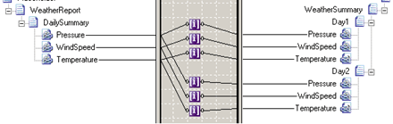

# Index Functoid
The **Index** functoid enables you to select information from a specific record in a series of records. Each **Index** functoid collects information from a single field.  
  
 Certain records typically occur many times in an input file. For example, in a weather report, the **DailySummary** element might occur many times. The **DailySummary** element might include attributes for the temperature, the barometric pressure, and the wind speed. The following code is an example of a weather report.  
  
```  
<ns0:WeatherReport xmlns:ns0="http://IndexFunctoid.WeatherReport">  
    <DailySummary Pressure="80" Windspeed="10" Temperature="20" />  
    <DailySummary Pressure="78" Windspeed="20" Temperature="23" />  
    <DailySummary Pressure="77" Windspeed="16" Temperature="24" />  
</ns0:WeatherReport>  
```  
  
 In the underlying schema, the **Max Occurs** property for the **DailySummary** record would be set to unbounded to indicate a recurring or looping record. BizTalk Mapper compiles this record as a loop.  
  
 Suppose you want to collect weather information for the first two **DailySummary** records of the weather report. In BizTalk Mapper, each attribute from the **DailySummary** record of the incoming source schema can be connected to an **Index** functoid. In turn, each **Index** functoid can specify the **DailySummary** record from which to draw the information: the first or second. The **Index** functoids can then be connected to the appropriate fields of the destination schema.  
  
 The following figure shows **Index** functoids used in this way.  
  
   
Index Functoid Example  
  
 To get the daily summary information for the first day, the upper set of three **Index** functoids have their index values set to 1. To get the daily summary information for the second day, the lower set of three **Index** functoids have their index values set to 2.  
  
 **Index** functoids use the **Configure \<Functoid\> Functoid** dialog box to set their input parameters. The first input parameter identifies a field within a looping record in the source schema. The second and succeeding input parameters specify the particular record. You can specify multiple index values to select a record within nested repeating structures. The index value for the innermost structure is the second parameter. The index value for the next outermost structure would be the third parameter, and so on. For example, suppose that the preceding **DailySummary** records were inside **WeeklyData** records. To retrieve the **Pressure** from the first **DailySummary** in the second **WeeklyData**, the second parameter would be 1 and the third parameter would be 2.  
  
 Notice that this example assumes the **Pressure** field does not repeat. If the field did repeat, the indices would be off—the count would begin with the **Pressure** field, rather than the **Daily Summary**.  
  
> [!NOTE]
>  Although an index sequence input parameter is typically a constant, it is possible to use a link from a node in the source schema. If this link comes from a looping record that is not a parent of the first input parameter, the index sequence input value comes from the first instance of the node in the input instance message.  
  
> [!NOTE]
>  The value of the index sequence input is always in relation to the current context in the source document.  
  
> [!IMPORTANT]
>  An **Index** functoid must have as many index values as there are parent nodes from the field level to the first level below the root node. For example, in the multiple weather report instance message, two index values are required. In the single weather report instance message, only one index value is required. Failure to set the required number of index values of an **Index** functoid creates output based on the first node in the source instance message that matches the first input parameter of the **Index** functoid.  
  
## See Also  
 [How to Add Index Functoids to a Map](../core/how-to-add-index-functoids-to-a-map.md)   
 [Advanced Functoids](../core/advanced-functoids.md)   
 [Iteration Functoid](../core/iteration-functoid.md)   
 [Record Count Functoid](../core/record-count-functoid.md)
