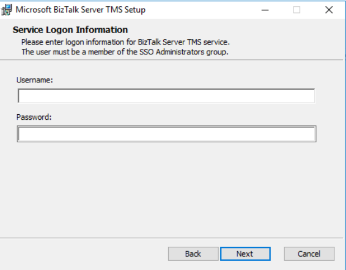

# Install and Configure BizTalk Server TMS for Office 365 adapters in BizTalk Server

## Overview

**Starting with BizTalk Server 2016 Feature Pack 3**, you can send and receive messages between BizTalk Server and Office 365 Outlook features. The following adapters are included in Feature Pack 3:

- [Office 365 Outlook Email adapter](../core/office365-mail-adapter.md)
- [Office 365 Outlook Calendar adapter](../core/office365-calendar-adapter.md)
- [Office 365 Outlook Contact adapter](../core/office365-contact-adapter.md)

### TMS overview

BizTalk Server TMS is a service that manages the Office 365 OAuth tokens used by BizTalk. It refreshes these tokens periodically, ensuring that the tokens always remain valid. It has a dependency on Enterprise Single Sign On service (ENT SSO), and must be installed on a computer that hosts the master secret server.

## Prerequisites

- Install [Feature Pack 3](https://aka.ms/bts2016fp3) on your BizTalk Server

## Install and configure BizTalk Server TMS

1. Install [Feature Pack 3](https://aka.ms/bts2016fp3).
2. In `\Program Files (x86)\Microsoft BizTalk Server 2016`, run BizTalkTMS.msi.
3. Enter the username and password of a user that's a member of the SSO Administrators group.

> [!div class="mx-imgBorder"]
> 

## See also

[Office 365 Outlook adapters in BizTalk](../core/office365-adapters.md)

[What's new in Feature Pack](../core/configure-the-feature-pack.md)
