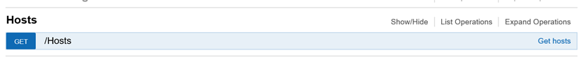
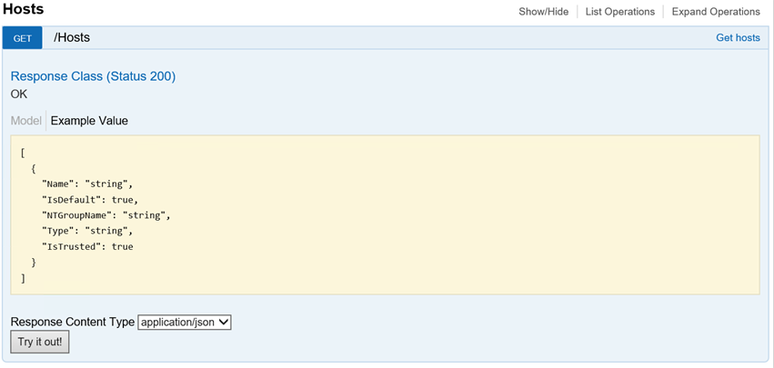
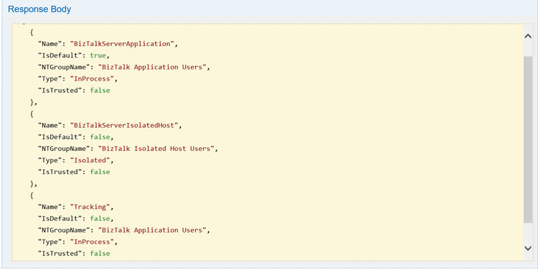

# Install and configure the management REST APIs in BizTalk Server

## What are management data APIs
Management data APIs are endpoints that let you remotely update, add, and query the status of different artifacts in your [!INCLUDE[btsBizTalkServerNoVersion_md](../includes/btsbiztalkservernoversion-md.md)] environment. The endpoints are added using REST, and come with a swagger definition. 

**Starting with [!INCLUDE[bts2016_md](../includes/bts2016-md.md)] [!INCLUDE[featurepack1](../includes/featurepack1.md)]**, there's a Windows PowerShell script that installs these REST APIs, and their swagger definitions. These APIs make REST calls to remotely manage ports, orchestrations, partners, agreements, pipelines, and more. 

## Prerequisites
* Install [Feature Pack 2](https://aka.ms/bts2016fp2) on your [!INCLUDE[btsBizTalkServerNoVersion_md](../includes/btsbiztalkservernoversion-md.md)]

* Install IIS on the [!INCLUDE[btsBizTalkServerNoVersion_md](../includes/btsbiztalkservernoversion-md.md)]. In most [!INCLUDE[btsBizTalkServerNoVersion_md](../includes/btsbiztalkservernoversion-md.md)] environments, IIS is already installed. See [Hardware and Software Requirements for BizTalk Server 2016](../install-and-config-guides/hardware-and-software-requirements-for-biztalk-server-2016.md). Confirm IIS is installed on the BizTalk Server by opening **Internet Information Services Manager**. 

## Step 1: Install the REST APIs

1. Run Windows PowerShell as Administrator (**Start** menu, type **PowerShell**, right click, and select **Run as administrator**). 
2. Go to the BizTalk installation folder (for example, type: `cd 'C:\Program Files (x86)\Microsoft BizTalk Server 2016\'`).
3. In the following text, replace `Default Web Site`, `mgmtServiceAppPool`, `domain/user`, `password`, and `domain\group` with your values:

    ```Powershell
    FeaturePack.ConfigureServices.ps1 -Service management -WebSiteName '<Default Web Site>' -ApplicationPool <mgmtServiceAppPool> -ApplicationPoolUser <domain>\<user> -ApplicationPoolUserPassword <password> -AuthorizationRoles '<domain>\<group>, <domain>\<group>'
    ```

    In the following example, we use the `Default Web Site`, create an application pool named `RESTAppPool`, run the appPool as the `bootcampbts2016\btsservice` account, use `BIZTALK-serviceacct` as the user account password, and give the BizTalk Server Administrators group permissions. Be sure to enter the following, including the single quotes surrounding values with spaces: 

    ```Powershell
    FeaturePack.ConfigureServices.ps1 -Service management -WebSiteName 'Default Web Site' -ApplicationPool RESTAppPool -ApplicationPoolUser bootcampbts2016\btsservice -ApplicationPoolUserPassword  BIZTALK-serviceacct -AuthorizationRoles 'BOOTCAMPBTS2016\BizTalk Server Administrators'
    ```

    When complete, the **BizTalkManagementService** application is created within IIS:  
    

4. To confirm it’s working, browse to `http://localhost/BizTalkManagementService/swagger`. If you are prompted to sign-in, sign in with an account that is member of the domain\group you entered in the previous step (`-AuthorizationRoles 'BOOTCAMPBTS2016\BizTalk Server Administrators'`). 

> [!WARNING]
> The BizTalkManagementService application in IIS uses a web.config file. Elements within web.config **are case sensitive**. So when you execute the Windows PowerShell script, be sure to enter the correct case for `-AuthorizationRoles` value. If you’re not sure of the case, here’s an easy way to find out: 
> 
> 1. Open **Computer Management**, and expand **Local Users and Groups**.
> 2. Select **Groups**, and scroll down to the **SQLServer…** groups. 
> 3. In the following example, notice **BOOTCAMPBTS2016** is in all caps. If you see all caps, then enter the computer name in all caps. 
> 
> 

Now that the REST APIs are exposed through IIS, they can be accessed and executed by other applications. 

You can change who has access by manually updating the **web.config** file, which is in the root folder of the management application. For example, use the following to allow anyone access to the swagger output: 

```
<authorization>
   <allow users="*" />
</authorization>
```

## Step 2: Test the APIs

1. On the BizTalk Server, browse to `http://localhost/BizTalkManagementService/swagger`.

2. Scroll to **Hosts**, and select **Show/Hide**. There is a GET command; click this row:  


3. It shows the details. Select **Try it out**:  


4. The Response Body returns all the hosts:  


> [!NOTE]
> If you browse to `http://localhost/BizTalkManagementService`, you should get a 500 error. That’s a good thing. Just add `/swagger` to the end of URL, and you’ll see the available REST APIs. 


## See also
 [Configure the Feature Pack](../core/configure-the-feature-pack.md)