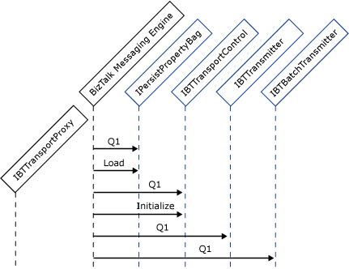
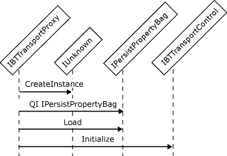

# Instantiating and Initializing a Send Adapter
By default, send adapters are not instantiated until the first message is delivered to them, a process known as "lazy creation." The default lazy creation approach helps to conserve system resources. After the send adapter is created, it is cached and lives until the BizTalk Server service is stopped.  
  
 The **InitTransmitterOnServiceStart** member of the **Capabilities** enumeration directs the Messaging Engine to create the send adapter on service startup, rather than using the default lazy creation, if this is desired.  
  
 Sending a message is a different model than receiving a message with respect to batching of messages. In the receive case the adapter has incoming messages to insert into a batch obtained from the Messaging Engine. In the send case the Messaging Engine obtains a batch from the adapter and sends messages to the adapter to be transmitted. Both use the transport proxy to obtain the message batch objects.  
  
## How a Send Adapter Is Initialized  
 To enable configuration and binding to the transport proxy, adapters must implement the following configuration interfaces:  
  
- **IBTTransport**  
  
- **IBaseComponent**  
  
- **IBTTransportControl**  
  
- **IPersistPropertyBag**  
  
  The following steps describe the sequence of events involved in initializing a send adapter:  
  
1. When the Messaging Engine initializes a send adapter, it first performs a **QueryInterface** for **IPersistPropertyBag**, which is an optional interface. If the adapter implements the interface, the handler configuration is passed to the adapter in the **Load** method call. The adapter uses this information to ensure it is configured correctly.  
  
2. The Messaging Engine performs a **QueryInterface** for **IBTTransportControl**, which is a mandatory interface.  
  
3. The engine calls **IBTTransportControl.Initialize**, passing in the transport proxy for the adapter.  
  
4. The Messaging Engine performs a **QueryInterface** for **IBTTransmitter**.  
  
    If the Messaging Engine discovers this interface, the adapter is treated as a batch-unaware transmitter.  
  
    If the Messaging Engine does not discover this interface, the Messaging Engine performs a **QueryInterface** for **IBTBatchTransmitter**, discovery of which indicates that the adapter is a batch-aware transmitter.  
  
    If the Messaging Engine discovers neither of these interfaces, an error condition results, causing the initialization to fail. The initialization fails if any mandatory interfaces are not discovered.  
  
   The following diagram illustrates this sequence of API calls; the interfaces in blue are implemented by the adapter.  
  
     
  
   The adapter can send messages as soon as it is initialized and configured.  
  
   The following figure shows the object interactions involved in initializing a send adapter.  
  
     
   Workflow for initializing a send adapter  
  
> [!NOTE]
>  Adapters should not block the Messaging Engine in calls such as **IBTTransportControl.Initialize** and **IPersistPropertyBag.Load**. Performing excessive processing in these calls affects service startup time.