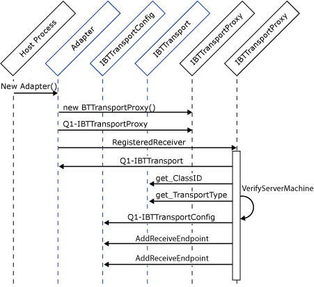

# Instantiating Isolated Adapters
As discussed earlier, isolated adapters are not instantiated by BizTalk Server. Rather, they are instantiated and hosted in another process. It is the responsibility of the adapter to create its transport proxy, **QueryInterface**, for **IBTTransportProxy**, and then call **IBTTransportProxy**.**RegisterIsolatedReceiver** to register with the Messaging Engine.  
  
 Registration requires that the adapter pass one of its configured and enabled receive locations to the Messaging Engine. The adapter's host process credentials must be a member of the BizTalk Isolated Host Users group. Simply using impersonation here is insufficient unless the user is a member of that group. In addition, the adapter is queried to ensure it has the correct **ClassID** and is running on the computer that was configured for that host instance. After the adapter has successfully registered with its transport proxy, its configuration is sent to it using by calling the Load method of the **IPersistPropertyBag** interface.  
  
 The following figure illustrates this sequence of API calls. The interfaces in blue are implemented by the adapter.  
  
   
  
 The following code fragment illustrates the registration API calls:  
  
```  
using Microsoft.BizTalk.TransportProxy.Interop;  
using Microsoft.BizTalk.Component.Interop;  
using Microsoft.BizTalk.Message.Interop;  
  
public class MyAdapter : IBTTransport,   
 IBTTransportConfig,   
 IBTTransportControl,   
 IBaseComponent  
{  
...  
private IBTTransportProxy transportProxy;  
  
 public void Register(string uri)  
 {  
 // Create the Transport Proxy...  
 this.transportProxy =   
 (IBTTransportProxy)new BTTransportProxy();  
  
// Register on of the adapters uri’s with the TP  
 this.transportProxy.RegisterIsolatedReceiver(  
 uri,   
 (IBTTransportConfig)this );  
 }  
}  
```  
  
 **Implementation Tip:** We recommend that the adapter keep a count of the work in progress. The adapter should block **Terminate** until the message count has reached zero. On the receive side this work includes any outstanding requests that have not been published to BizTalk Server. Response messages are not delivered to a receive adapter after **Terminate** has been called.  
  
 For send adapters, messages that are in progress should be handled appropriately. This means any message that was successfully delivered should be deleted from the adapter's private application message queue to prevent messages from being sent more than once.  
  
 After **Terminate** is called the Messaging Engine does not accept requests to publish new messages, with the exception of response messages for solicit-response pairs.