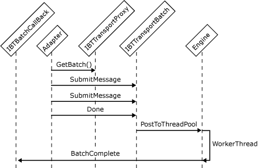

# Interfaces for a Batch-Supported Receive Adapter
A receive adapter always submits messages in a batch. A batch is a unit of database operations that you can use for actions other than submission. For example, a receive adapter can submit one set of messages, suspend a different set of messages, and delete another set of messages in the same batch. Grouping these separate operations in the same batch optimizes performance by minimizing the number of database round trips required and is strongly encouraged.  
  
 In-process and isolated receive adapters need to implement the following interfaces to submit batches of messages into the server:  
  
- **IBTTransport**  
  
- **IBTTransportControl** (in-process adapters only)  
  
- **IBTTransportConfig**  
  
- **IBaseComponent**  
  
- **IPersistPropertyBag**  
  
- **IBTBatchCallBack**  
  
  The following steps describe the sequence of actions that a receive adapter performs to submit messages into the server.  
  
1. A receive adapter obtains the batch from the transport proxy by calling the **GetBatch** method of the **IBTTransportProxy** interface. In its call to **GetBatch** the adapter passes in a pointer to its **IBTBatchCallback** interface implementation.  
  
2. An adapter adds the messages one at a time into the batch by calling the **SubmitMessage** method of the **IBTTransportBatch** interface. If this is a two-way operation such as solicit-response messaging, the **SubmitResponseMessage** method of this same interface is called to submit the response message.  
  
3. When all the messages have been added to the batch, the adapter calls the **Done** method of the **IBTTransportBatch** interface to submit the batch to the transport proxy. Because receive adapters are asynchronous in nature, the adapter can immediately obtain a new batch and start submitting other messages after it calls **Done**.  
  
4. After the batch has been processed, the Messaging Engine invokes the adapter's **BatchComplete** callback method using the transport proxy to make the actual call. An array of **BTBatchOperationStatus** objects containing the status of the submission is passed to the adapter. Each object corresponds to an operation type and contains the overall status of the operation as well as the status for each message for which the operation was performed. The following sequence describes the actions the adapter needs to perform to analyze the status of batch processing:  
  
   1.  Check the overall batch status HRESULT value passed as a parameter to the **BatchComplete** method. If it is a failure, it means that at least one of the operations in the batch was unsuccessful. Therefore the submission of the entire batch as one entity failed. The adapter should then try to discover the offending message(s) and resubmit as a batch only the ones that did not initially cause a failure.  
  
        If the overall batch status succeeded, it means that all the messages that were given to the transport proxy were persisted to disk. However, it does not mean that the pipeline successfully processed all the messages. It is possible that messages that failed in the pipeline were suspended. For messages that fail in the pipeline, the overall batch status returned is successful because the data was written to disk.  
  
   2.  Check the status for each operation type in the `operationStatus` parameter. If the status is **S_OK**, the submission for this operation succeeded and you do not need to check the status any further. If the status is set to **BTS_S_EPM_MESSAGE_SUSPENDED** some of the messages were suspended. **BTS_S_EPM_SECURITY_CHECK_FAILED** signifies that some messages failed authentication in an authentication-required receive port. If **E_FAIL** is returned, or any HRESULT with a value that is less than zero, the message submission for this operation failed.  
  
   3.  Check the status of individual messages for the operation type. For the submit operation type, the status of each message is set to **S_OK** if the submission succeeded. **BTS_S_EPM_MESSAGE_SUSPENDED** is returned if the message was suspended. **BTS_S_EPM_SECURITY_CHECK_FAILED** is returned if the message failed authentication on a receive port that requires authentication. **E_BTS_NO_SUBSCRIPTION** comes back if there were no subscribers for the published message. If **E_FAIL** is returned, or any HRESULT with a value that is less than zero, the message submission failed.  
  
   4.  Depending on your adapter, you may want to suspend messages that return **E_FAIL** or any failing HRESULT.  
  
5. The **BatchComplete** method needs to return either **S_OK** or **E_FAIL** to indicate the result of execution. If the **BatchComplete** method returns **E_FAIL** or any negative HRESULT, the transport proxy logs an error.  
  
   The following figure shows the object interactions involved in creating a batch-supported receive adapter.  
  
     
   Workflow for a receive adapter submitting a batch of messages  
  
## See Also  
 [Adapter Variables](../core/adapter-variables.md)   
 [Developing a Receive Adapter](../core/developing-a-receive-adapter.md)   
 [Instantiating and Initializing a Receive Adapter](../core/instantiating-and-initializing-a-receive-adapter.md)   
 [Interfaces for an In-Process Receive Adapter](../core/interfaces-for-an-in-process-receive-adapter.md)   
 [Interfaces for an Isolated Receive Adapter](../core/interfaces-for-an-isolated-receive-adapter.md)   
 [Interfaces for a Transactional Batch-Supported Receive Adapter](../core/interfaces-for-a-transactional-batch-supported-receive-adapter.md)   
 [Interfaces for a Synchronous Request-Response Receive Adapter](../core/interfaces-for-a-synchronous-request-response-receive-adapter.md)