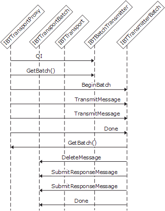

# Interfaces for a Solicit-Response Send Adapter
Send adapters use the same batch mechanism as receive adapters to submit response messages back into the server.  
  
> [!NOTE]
>  It is recommended that a solicit-response adapter is process messages asynchronously. If the adapter processes message in a synchronous manner, there is a risk of message duplication.  
  
 Send adapters need to implement the following interfaces to work in solicit-response mode:  
  
- **IBTTransport**  
  
- **IBaseComponent**  
  
- **IBTTransportControl**  
  
- **IPersistPropertyBag**  
  
- **IBTTransmitter**  
  
- **IBTTransmitterBatch** and **IBTBatchTransmitter** (if send batching is required)  
  
- **IBTBatchCallBack**  
  
  The steps involved in the object interaction are as follows:  
  
1. After the adapter sends a solicit message, it receives back a response message from that destination server. It then obtains a batch from the transport proxy.  
  
2. The adapter adds the response message to the batch by calling **IBTTransportProxy::SubmitResponseMessage**.  
  
3. The adapter submits the batch by calling **IBTTransportProxy::Done** passing in a pointer to its **IBTBatchComplete** interface for the callback from the Messaging Engine.  
  
4. The Messaging Engine calls the adapter's **IBTBatchCallBack::BatchComplete** callback method using the transport proxy notifying it of the result of submission operation.  
  
   The following figure shows the object interactions involved in creating a solicit-response send adapter.  
  
     
   Interaction diagram for a solicit-response send adapter  
  
## See Also  
 [Adapter Variables](../core/adapter-variables.md)   
 [Developing a Send Adapter](../core/developing-a-send-adapter.md)   
 [Instantiating and Initializing a Send Adapter](../core/instantiating-and-initializing-a-send-adapter.md)   
 [Interfaces for a Synchronous Send Adapter](../core/interfaces-for-a-synchronous-send-adapter.md)   
 [Interfaces for an Asynchronous Send Adapter](../core/interfaces-for-an-asynchronous-send-adapter.md)   
 [Interfaces for a Synchronous Batch-Supported Send Adapter](../core/interfaces-for-a-synchronous-batch-supported-send-adapter.md)   
 [Interfaces for an Asynchronous Batch-Supported Send Adapter](../core/interfaces-for-an-asynchronous-batch-supported-send-adapter.md)   
 [Interfaces for a Transactional Asynchronous Batch-Supported Send Adapter](../core/interfaces-for-a-transactional-asynchronous-batch-supported-send-adapter.md)