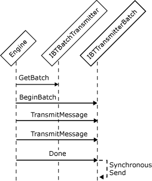

# Interfaces for a Synchronous Batch-Supported Send Adapter
Batch-aware adapters may send messages synchronously or asynchronously, and may perform transacted send operations. To send batches of messages, a send adapter must implement the following interfaces:  
  
- **IBTTransport**  
  
- **IBaseComponent**  
  
- **IBTTransportControl**  
  
- **IPersistPropertyBag**  
  
- **IBTBatchTransmitter**  
  
- **IBTTransmitterBatch**  
  
  For the synchronous batch send, the Messaging Engine gets a batch from the adapter and adds messages to be transmitted to that batch. The Messaging Engine adds each message to the batch and sends the messages only when it calls the **Done** method on the batch. The adapter returns `True` for **bDeleteMessage** for each message that it intends to transmit synchronously. The adapter should save message data, as opposed to a message pointer, in its **TransmitMessage** implementation. This is because the message pointer is no longer valid after `True` is returned, and should not be used or cached for later use.  
  
  The following figure shows the object interactions involved in creating a synchronous batch-supported send adapter.  
  
    
  Workflow for submitting a message synchronously  
  
## See Also  
 [Adapter Variables](../core/adapter-variables.md)   
 [Developing a Send Adapter](../core/developing-a-send-adapter.md)   
 [Instantiating and Initializing a Send Adapter](../core/instantiating-and-initializing-a-send-adapter.md)   
 [Interfaces for a Synchronous Send Adapter](../core/interfaces-for-a-synchronous-send-adapter.md)   
 [Interfaces for an Asynchronous Send Adapter](../core/interfaces-for-an-asynchronous-send-adapter.md)   
 [Interfaces for an Asynchronous Batch-Supported Send Adapter](../core/interfaces-for-an-asynchronous-batch-supported-send-adapter.md)   
 [Interfaces for a Transactional Asynchronous Batch-Supported Send Adapter](../core/interfaces-for-a-transactional-asynchronous-batch-supported-send-adapter.md)   
 [Interfaces for a Solicit-Response Send Adapter](../core/interfaces-for-a-solicit-response-send-adapter.md)