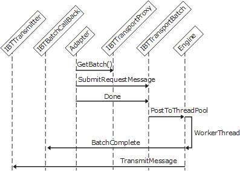

# Interfaces for a Synchronous Request-Response Receive Adapter
All receive adapters need to implement the following interfaces to work in request-response mode:  
  
- **IBTTransport**  
  
- **IBTTransportControl** (regular adapters only)  
  
- **IBTTransportConfig**  
  
- **IBaseComponent**  
  
- **IPersistPropertyBag**  
  
- **IBTBatchCallBack**  
  
- **IBTTransmitter**  
  
  Receive adapters that support request-response protocols (for example, the HTTP receive adapter) perform the following actions when submitting request messages:  
  
1. The receive adapter receives incoming request messages. It obtains a batch from the transport proxy by calling the **GetBatch** method of the **IBTTransportProxy** interface. In this call the adapter passes in a callback pointer to its implementation of the **IBTBatchCallBack.BatchComplete** method.  
  
2. The adapter adds request messages into the batch by calling the **SubmitRequestMessage** method of the **IBTTransportBatch** interface, once for each request message.  
  
3. When all the messages have been added, the adapter calls the **Done**method of the **IBTTransportBatch** interface, which submits the batch to the Messaging Engine through the transport proxy.  
  
4. After the batch has been processed, the Messaging Engine invokes the adapter's **IBTBatchCallBack.BatchComplete** callback method through the transport proxy. The status of the submission is passed to the adapter as an array of HRESULT values corresponding to each message in the batch. If the batch fails, either in the pipeline or in the orchestration, the SOAP fault message is returned to the adapter as a response.  
  
5. The incoming request messages may have orchestration subscribers. After the orchestration completes and the request message has been processed, the Messaging Engine sends the response message through the transport proxy to the adapter by calling the adapter's **TransmitMessage** method from the **IBTTransmitter** interface.  
  
6. The adapter sends a response message and deletes the original message from the MessageBox database.  
  
   The following figure shows the object interactions involved in creating a synchronous request-response receive adapter.  
  
     
   Workflow for a receive adapter submitting a synchronous message  
  
## See Also  
 [Adapter Variables](../core/adapter-variables.md)   
 [Developing a Receive Adapter](../core/developing-a-receive-adapter.md)   
 [Instantiating and Initializing a Receive Adapter](../core/instantiating-and-initializing-a-receive-adapter.md)   
 [Interfaces for an In-Process Receive Adapter](../core/interfaces-for-an-in-process-receive-adapter.md)   
 [Interfaces for an Isolated Receive Adapter](../core/interfaces-for-an-isolated-receive-adapter.md)   
 [Interfaces for a Batch-Supported Receive Adapter](../core/interfaces-for-a-batch-supported-receive-adapter.md)   
 [Interfaces for a Transactional Batch-Supported Receive Adapter](../core/interfaces-for-a-transactional-batch-supported-receive-adapter.md)