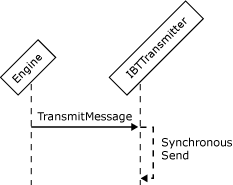

# Interfaces for a Synchronous Send Adapter
An adapter sends messages synchronously when it blocks the incoming Messaging Engine calling thread while performing its send operation. To be able to send messages synchronously, an adapter needs to implement the following interfaces:  
  
- **IBTTransport**  
  
- **IBaseComponent**  
  
- **IBTTransportControl**  
  
- **IPersistPropertyBag**  
  
- **IBTTransmitter**  
  
  In a synchronous send, the adapter sends the message while blocking **TransmitMessage**, and after successful transmission returns `True.`  
  
  The following figure shows the object interactions involved in creating a synchronous send adapter.  
  
    
  Workflow for sending a message synchronously  
  
## See Also  
 [Adapter Variables](../core/adapter-variables.md)   
 [Developing a Send Adapter](../core/developing-a-send-adapter.md)   
 [Instantiating and Initializing a Send Adapter](../core/instantiating-and-initializing-a-send-adapter.md)   
 [Interfaces for an Asynchronous Send Adapter](../core/interfaces-for-an-asynchronous-send-adapter.md)   
 [Interfaces for a Synchronous Batch-Supported Send Adapter](../core/interfaces-for-a-synchronous-batch-supported-send-adapter.md)   
 [Interfaces for an Asynchronous Batch-Supported Send Adapter](../core/interfaces-for-an-asynchronous-batch-supported-send-adapter.md)   
 [Interfaces for a Transactional Asynchronous Batch-Supported Send Adapter](../core/interfaces-for-a-transactional-asynchronous-batch-supported-send-adapter.md)   
 [Interfaces for a Solicit-Response Send Adapter](../core/interfaces-for-a-solicit-response-send-adapter.md)
