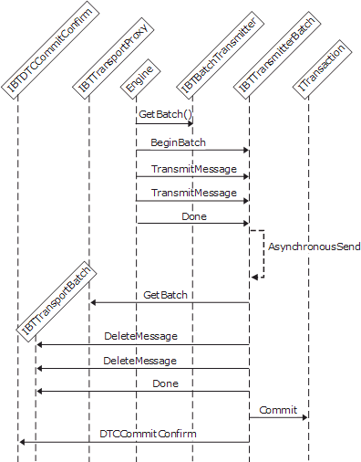

# Interfaces for a Transactional Asynchronous Batch-Supported Send Adapter
A send adapter can create and control transactions when transactional transmission of messages is required. To support transactional send, an adapter needs to implement the following interfaces:  
  
- **IBTTransport**  
  
- **IBaseComponent**  
  
- **IBTTransportControl**  
  
- **IPersistPropertyBag**  
  
- **IBTBatchTransmitter**  
  
- **IBTTransmitterBatch**  
  
- **IBTBatchCallBack**  
  
  An adapter creates an MSDTC transaction and returns a pointer to that object in the call to the **BeginBatch** method of the **IBTTransmitterBatch** interface. The Messaging Engine calls this method to obtain a batch with which it posts outgoing messages to the send adapter. When the adapter finishes the send operation and commits or rolls back a transaction, it notifies the Messaging Engine of the result of the transaction by using the **DTCCommitConfirm** method of the **IBTDTCCommitConfirm** interface.  
  
  The following figure shows the interaction between the transport proxy and the send adapter when performing a transactional send operation.  
  
    
  Workflow for sending a transactional message asynchronously  
  
## See Also  
 [Adapter Variables](../core/adapter-variables.md)   
 [Developing a Send Adapter](../core/developing-a-send-adapter.md)   
 [Instantiating and Initializing a Send Adapter](../core/instantiating-and-initializing-a-send-adapter.md)   
 [Interfaces for a Synchronous Send Adapter](../core/interfaces-for-a-synchronous-send-adapter.md)   
 [Interfaces for an Asynchronous Send Adapter](../core/interfaces-for-an-asynchronous-send-adapter.md)   
 [Interfaces for a Synchronous Batch-Supported Send Adapter](../core/interfaces-for-a-synchronous-batch-supported-send-adapter.md)   
 [Interfaces for an Asynchronous Batch-Supported Send Adapter](../core/interfaces-for-an-asynchronous-batch-supported-send-adapter.md)   
 [Interfaces for a Solicit-Response Send Adapter](../core/interfaces-for-a-solicit-response-send-adapter.md)