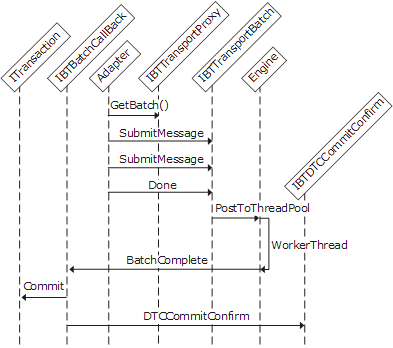

# Interfaces for a Transactional Batch-Supported Receive Adapter
A receive adapter creates and controls transactions when the transactional submission of messages is required.  
  
 A transactional receive adapter creates and passes a pointer to a Microsoft Distributed Transaction Coordinator (MSDTC) transaction on the **Done** method of the **IBTTransportBatch** interface. This ensures that all batch operations are performed in the scope of that specific transaction object. When the batch submission completes, the adapter callback method commits or rolls back the transaction. Which action it takes depends upon the status returned from the transport proxy, and possibly upon other transaction-related work that the adapter does that is not visible to the transport proxy. The adapter determines whether the transaction failed or succeeded. The adapter reports the result of the transaction (commit or rollback) back to the transport proxy by using the **DTCCommitConfirm** method of the**IBTDTCCommitConfirm** interface. It passes in `true` for a successful transaction or `false` for a failure.  
  
 The following figure shows the object interactions involved in creating a transactional batch-supported receive adapter.  
  
   
Workflow for a receive adapter submitting a batch of messages using DTC transactions  
  
## See Also  
 [Adapter Variables](../core/adapter-variables.md)   
 [Developing a Receive Adapter](../core/developing-a-receive-adapter.md)   
 [Instantiating and Initializing a Receive Adapter](../core/instantiating-and-initializing-a-receive-adapter.md)   
 [Interfaces for an In-Process Receive Adapter](../core/interfaces-for-an-in-process-receive-adapter.md)   
 [Interfaces for an Isolated Receive Adapter](../core/interfaces-for-an-isolated-receive-adapter.md)   
 [Interfaces for a Batch-Supported Receive Adapter](../core/interfaces-for-a-batch-supported-receive-adapter.md)   
 [Interfaces for a Synchronous Request-Response Receive Adapter](../core/interfaces-for-a-synchronous-request-response-receive-adapter.md)
