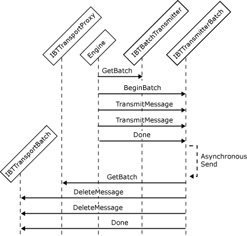

# Interfaces for an Asynchronous Batch-Supported Send Adapter
Batch-aware adapters may send messages synchronously or asynchronously, and may perform transacted sends. To send batches of messages, a send adapter must implement the following interfaces:  
  
- **IBTTransport**  
  
- **IBaseComponent**  
  
- **IBTTransportControl**  
  
- **IPersistPropertyBag**  
  
- **IBTBatchTransmitter**  
  
- **IBTTransmitterBatch**  
  
  For the asynchronous batch send, the Messaging Engine gets a batch from the adapter and adds messages to be transmitted to that batch. The messages are only sent when the Messaging Engine calls the **Done** method on the batch. The adapter returns `False` for each message that it intends to transmit asynchronously. The adapter then gets a batch from the adapter proxy and deletes those messages that it successfully transmitted.  
  
  The following figure shows the object interactions involved in creating an asynchronous batch-supported send adapter.  
  
    
  Workflow for sending a message asynchronously  
  
## See Also  
 [Adapter Variables](../core/adapter-variables.md)   
 [Developing a Send Adapter](../core/developing-a-send-adapter.md)   
 [Instantiating and Initializing a Send Adapter](../core/instantiating-and-initializing-a-send-adapter.md)   
 [Interfaces for a Synchronous Send Adapter](../core/interfaces-for-a-synchronous-send-adapter.md)   
 [Interfaces for an Asynchronous Send Adapter](../core/interfaces-for-an-asynchronous-send-adapter.md)   
 [Interfaces for a Synchronous Batch-Supported Send Adapter](../core/interfaces-for-a-synchronous-batch-supported-send-adapter.md)   
 [Interfaces for a Transactional Asynchronous Batch-Supported Send Adapter](../core/interfaces-for-a-transactional-asynchronous-batch-supported-send-adapter.md)   
 [Interfaces for a Solicit-Response Send Adapter](../core/interfaces-for-a-solicit-response-send-adapter.md)