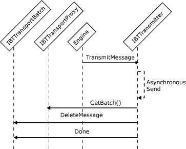

# Interfaces for an Asynchronous Send Adapter
Adapters sending messages one at a time may send messages either synchronously or asynchronously. An adapter sends messages asynchronously when it does not block the transport proxy thread but rather uses a separate thread while performing the send operations. To be able to send messages asynchronously, an adapter needs to implement the following interfaces:  
  
- **IBTTransport**  
  
- **IBaseComponent**  
  
- **IBTTransportControl**  
  
- **IPersistPropertyBag**  
  
- **IBTTransmitter**  
  
  The following steps describe the sequence of actions that the send adapter performs to transmit messages out of the server at the request of the Messaging Engine:  
  
1.  The Messaging Engine uses the transport proxy to pass an outgoing message to a send adapter by calling the **TransmitMessage** method of the **IBTTransmitter** interface.  
  
2.  The adapter returns immediately from **TransmitMessage** after storing the message to be sent to some internal queue, and returns `False` for **bDeleteMessage**. This tells the Messaging Engine the message will be transmitted in an asynchronous manner.  
  
3.  The adapter sends the message using its own thread pool.  
  
4.  After the send operation completes, the adapter deletes the original message from the MessageBox database. It obtains a batch from the Messaging Engine using the **IBTTransportBatch.GetBatch** method of the transport proxy, and then calls **DeleteMessage**.  
  
     The following figure shows the object interactions involved in creating an asynchronous send adapter.  
  
       
Workflow for sending a message asynchronously  
  
> [!NOTE]
>  We recommend that the adapter keep a count of the messages currently being processed. The adapter should block the **Terminate** method until the message count has reached zero. For send adapters, messages that are being processed should be handled appropriately. This means that any message that was successfully delivered asynchronously should be deleted from the adapter's private application message queue to prevent messages from being sent twice. In general, after **Terminate** is called by the Messaging Engine it does not accept requests to publish new messages from the adapter. The exception to this is response messages related to solicit-response pairs.  
  
## See Also  
 [Adapter Variables](../core/adapter-variables.md)   
 [Developing a Send Adapter](../core/developing-a-send-adapter.md)   
 [Instantiating and Initializing a Send Adapter](../core/instantiating-and-initializing-a-send-adapter.md)   
 [Interfaces for a Synchronous Send Adapter](../core/interfaces-for-a-synchronous-send-adapter.md)   
 [Interfaces for a Synchronous Batch-Supported Send Adapter](../core/interfaces-for-a-synchronous-batch-supported-send-adapter.md)   
 [Interfaces for an Asynchronous Batch-Supported Send Adapter](../core/interfaces-for-an-asynchronous-batch-supported-send-adapter.md)   
 [Interfaces for a Transactional Asynchronous Batch-Supported Send Adapter](../core/interfaces-for-a-transactional-asynchronous-batch-supported-send-adapter.md)   
 [Interfaces for a Solicit-Response Send Adapter](../core/interfaces-for-a-solicit-response-send-adapter.md)