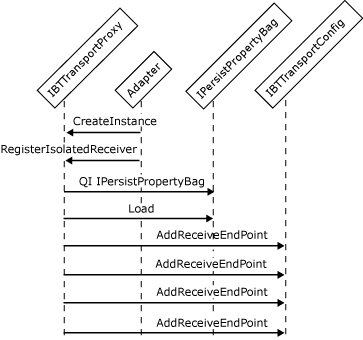

# Interfaces for an Isolated Receive Adapter
Isolated receive adapters are hosted in a process space other than the [!INCLUDE[btsBizTalkServerNoVersion](../includes/btsbiztalkservernoversion-md.md)] process. To interact with the Messaging Engine, an isolated receive adapter registers itself on startup so that the engine can configure and control it. The adapter creates the transport proxy, queries for the interface **IBTTransportProxy**, and calls **IBTTransportProxy.RegisterIsolatedReceiver** to register its **IBTTransportConfig** callback interface with the Messaging Engine. This synchronous call occurs before the adapter submits its first message to [!INCLUDE[btsBizTalkServerNoVersion](../includes/btsbiztalkservernoversion-md.md)]. This allows the Messaging Engine to call back into the adapter and tell it which of its endpoints are active and should be listened on for incoming messages. Isolated adapters must implement the following interfaces:  
  
- **IBTTransport**  
  
- **IBTTransportConfig**  
  
- **IBaseComponent**  
  
- **IPersistPropertyBag**  
  
  Registering the adapter requires the adapter to pass a configured and enabled receive location. The adapter's host process must be a member of the BizTalk Isolated Host Users group. In addition, the adapter is queried to ensure that it has the correct class ID and is running on the computer that was configured for that host instance.  
  
  After the adapter has successfully registered with the transport proxy, the Messaging Engine passes the configuration information and the other receive locations back to the adapter by calling the **Load** method of the **IPersistPropertyBag** interface and the **AddReceiveEndpoint** method of the **IBTTransportConfig** interface respectively.  
  
  When an isolated receive adapter ends the processing of messages and is going to be terminated, it must call the **TerminateIsolatedReceiver** method of the **IBTTransportProxy** interface.  
  
  The following illustration shows the object interactions involved in creating an isolated receive adapter.  
  
    
  Workflow for initializing an isolated receive adapter.  
  
> [!NOTE]
>  We recommend that the adapter keep track of currently executing requests to [!INCLUDE[btsBizTalkServerNoVersion](../includes/btsbiztalkservernoversion-md.md)]. The adapter should block the **Terminate** method until the work count has reached zero. On the receive side, this work includes any outstanding requests that have not been published to [!INCLUDE[btsBizTalkServerNoVersion](../includes/btsbiztalkservernoversion-md.md)]. Note that response messages are typically not delivered to a receive adapter after **Terminate** is called. In general, after the adapter calls the **Terminate** method, the Messaging Engine does not accept requests to publish new messages, with the exception of response messages for solicit-response pairs.  
> 
> [!NOTE]
>  One process may host several instances of isolated adapters, while only one process may host one adapter.  
  
## See Also  
 [Adapter Variables](../core/adapter-variables.md)   
 [Developing a Receive Adapter](../core/developing-a-receive-adapter.md)   
 [Instantiating and Initializing a Receive Adapter](../core/instantiating-and-initializing-a-receive-adapter.md)   
 [Interfaces for an In-Process Receive Adapter](../core/interfaces-for-an-in-process-receive-adapter.md)   
 [Interfaces for a Batch-Supported Receive Adapter](../core/interfaces-for-a-batch-supported-receive-adapter.md)   
 [Interfaces for a Transactional Batch-Supported Receive Adapter](../core/interfaces-for-a-transactional-batch-supported-receive-adapter.md)   
 [Interfaces for a Synchronous Request-Response Receive Adapter](../core/interfaces-for-a-synchronous-request-response-receive-adapter.md)