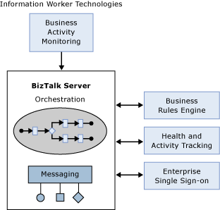
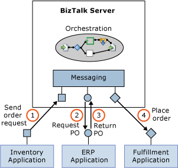
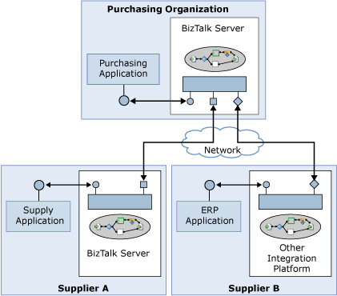

# Introducing BizTalk Server
Tying systems together is expected, and has become the norm. As organizations move toward a service-oriented world, the real goal—creating effective business processes that unite separate systems into a coherent whole—comes within reach.  
  
 Microsoft BizTalk Server allows connecting diverse software, then graphically creating and modifying process logic that uses that software. BizTalk Server also enables information workers to monitor running processes, interact with trading partners, and perform other business-oriented tasks.  
  
 Key new features in BizTalk Server are:  
  
-   Better support for deploying, monitoring, and managing applications  
  
-   Significantly simpler installation  
  
-   Improved capabilities for Business Activity Monitoring (BAM)  
  
BizTalk Server also uses the latest releases of other Microsoft technologies. It’s built on the .NET Framework, and the developer tools are hosted in Microsoft Visual Studio. For storage, BizTalk Server uses SQL Server. BizTalk Server can run on 64-bit Windows Servers, taking advantage of the larger memory and other benefits that the hardware offers.  
  
## What is BizTalk Server?  
 Combining different systems into effective business processes is a challenging problem. Accordingly, [!INCLUDE[btsBizTalkServerNoVersion](../includes/btsbiztalkservernoversion-md.md)] includes a range of technologies. The figure below illustrates the product’s major components.  
  
   
  
 As the figure suggests, the heart of the product is the [!INCLUDE[btsBizTalkServerNoVersion](../includes/btsbiztalkservernoversion-md.md)] Engine. The engine has two main parts:  
  
- A messaging component that provides the ability to communicate with a range of other software. By relying on adapters for different kinds of communication, the engine can support a variety of protocols and data formats, including Web services and many others.  
  
- Support for creating and running graphically-defined processes called orchestrations. Built on top of the engine’s messaging components, orchestrations implement the logic that drives all or part of a business process.  
  
  Several other BizTalk components can also be used in concert with the engine, including:  
  
- A Business Rule Engine that evaluates complex sets of rules.  
  
- A Group Hub that lets developers and administrators monitor and manage the engine and the orchestrations it runs.  
  
- An Enterprise Single Sign-On (SSO) facility that provides the ability to map authentication information between Windows and non-Windows systems.  
  
  On top of this foundation, [!INCLUDE[btsBizTalkServerNoVersion](../includes/btsbiztalkservernoversion-md.md)] includes Business Activity Monitoring, which information workers use to monitor a running business process. The information is displayed in business rather than technical terms, and business users determine what information is displayed.  
  
## Connecting Diverse Systems  
 The great majority of modern business processes depend at least in part on software. While some of these processes are supported by a single application, many others rely on diverse software systems. In many cases, this software has been created at different times, on different platforms, and using different technologies. Automating those business processes requires connecting diverse systems.  
  
 Addressing this challenge goes by various names: business process automation (BPA), business process management (BPM), and others. Regardless of the name, two scenarios are most important for application integration. One is connecting applications within a single organization, commonly referred to as enterprise application integration (EAI). The other, called business-to-business (B2B) integration, connects applications in different organizations.  
  
 The figure below shows a simple example of the core BizTalk Server engine applied to an EAI problem. In this scenario, an inventory application, perhaps running on an IBM mainframe, notices that the stock of an item is low and so issues a request to order more of that item. This request is sent to a BizTalk Server orchestration (step 1), which then issues a request to this organization’s ERP application requesting a purchase order (step 2). The ERP application, which might be running on a Unix system, sends back the requested PO (step 3), and the BizTalk Server orchestration then informs a fulfillment application, perhaps built on Windows using the .NET Framework, that the item should be ordered (step 4).  
  
   
  
 In this example, each application communicates using a different protocol. Accordingly, the messaging component of the BizTalk Server engine must be able to talk with each application in its native communication style. Also, notice that no single application is aware of the complete business process. The intelligence required to coordinate all of the software involved is implemented in the BizTalk Server orchestration.  
  
 Connecting applications within an organization is important, but connecting applications that span organizations can have at least as much value. The figure below shows a simple example of this kind of business-to-business integration. In this case, the purchasing organization at the top of the figure runs a BizTalk Server orchestration that interacts with two supplier organizations. Supplier A also uses BizTalk Server, providing indirect access to its Supply application. Supplier B uses an integration platform from another vendor, connecting to the purchasing organization’s BizTalk Server orchestration using, say, Web services.  
  
   
  
## See Also  
 [Understanding BizTalk Server](../core/understanding-biztalk-server.md)
