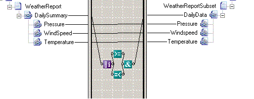

# Iteration Functoid
The **Iteration** functoid outputs the index of the current record in a looping structure, beginning at 1 for the first record, 2 for the second record, and so on.  
  
 The following figure shows an **Iteration** functoid combined with a **Greater Than or Equal To** functoid, a **Less Than or Equal To** functoid, and an **And** functoid to create the equivalent of a **For** loop.  
  
   
Iteration Functoid Map  
  
 Assume that the **Greater Than or Equal To** functoid tests for values greater than or equal to 2, and the **Less Than or Equal To** functoid tests for values less than or equal to 4. In that case, the **And** functoid will return **true** only for records 2, 3, and 4. Thus, the output instance will contain records two, three, and four of the input instance message.  
  
## See Also  
 [How to Add Iteration Functoids to a Map](../core/how-to-add-iteration-functoids-to-a-map.md)   
 [Advanced Functoids](../core/advanced-functoids.md)   
 [Index Functoid](../core/index-functoid.md)   
 [Looping Functoid](../core/looping-functoid.md)   
 [Record Count Functoid](../core/record-count-functoid.md)